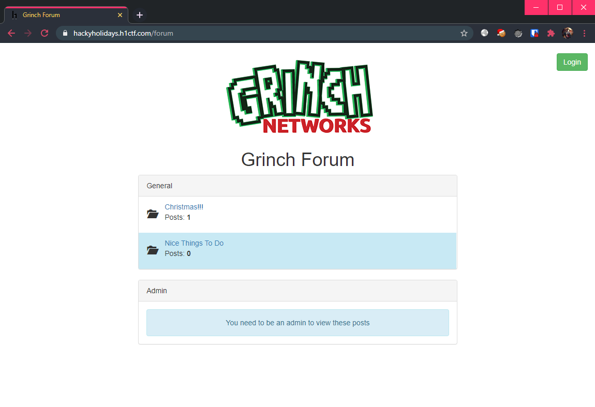
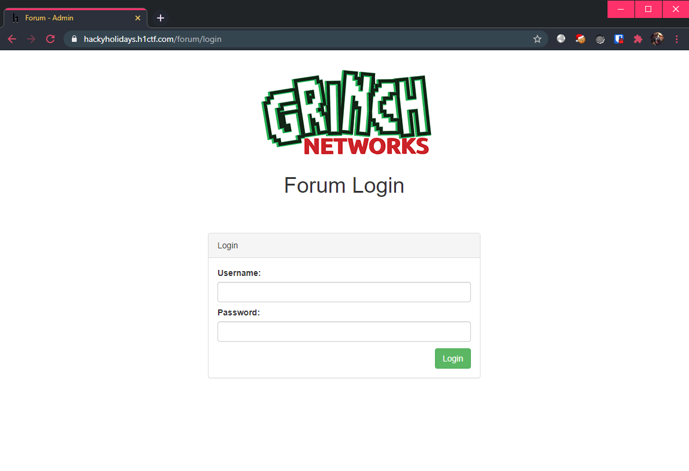
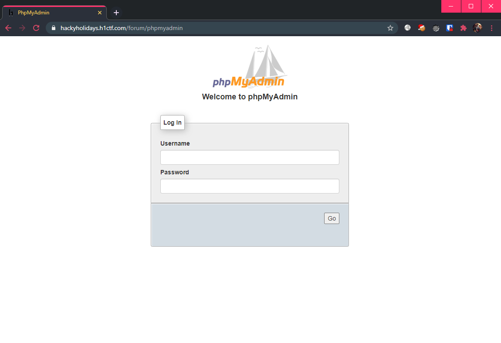
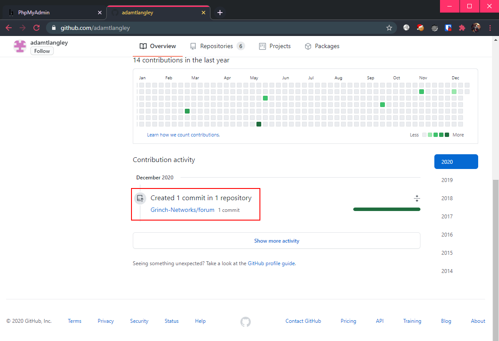
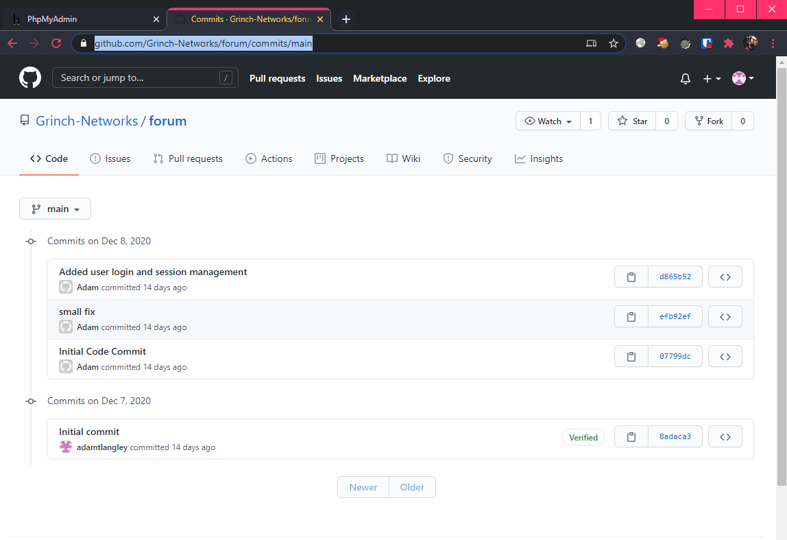
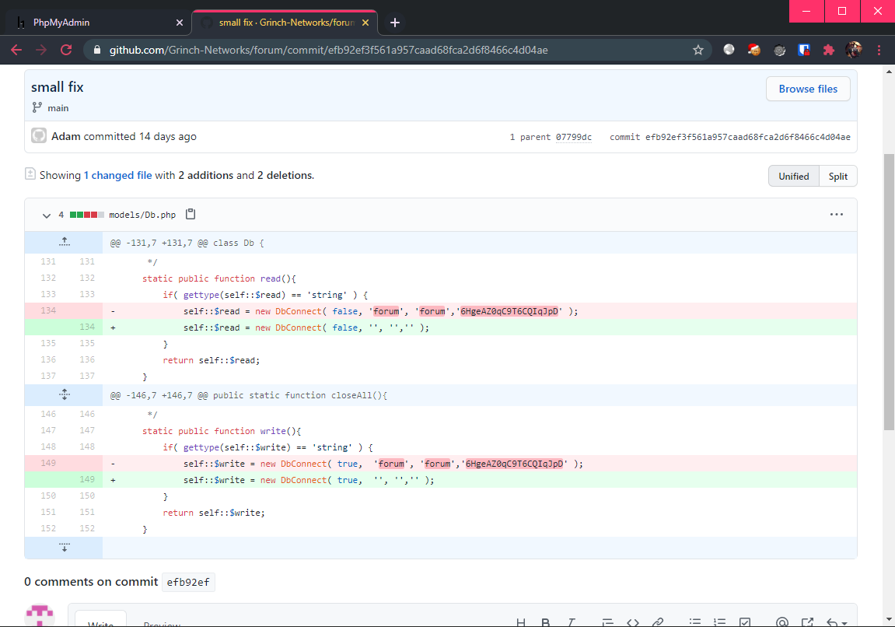
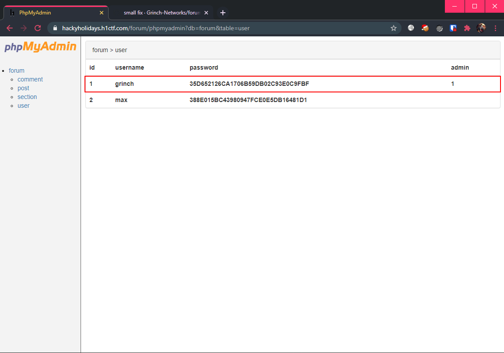
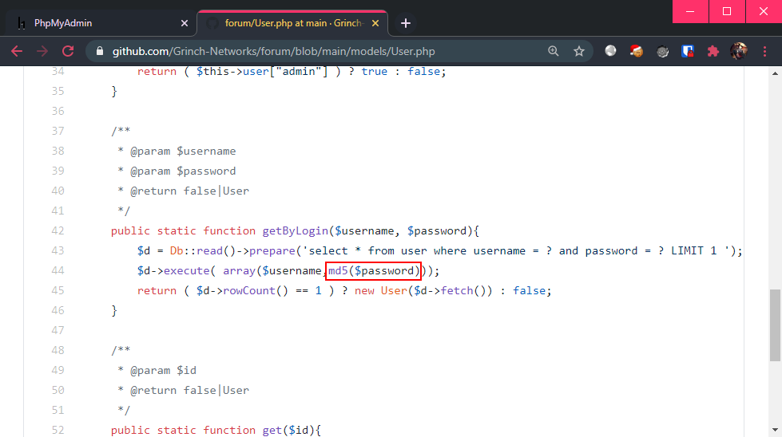
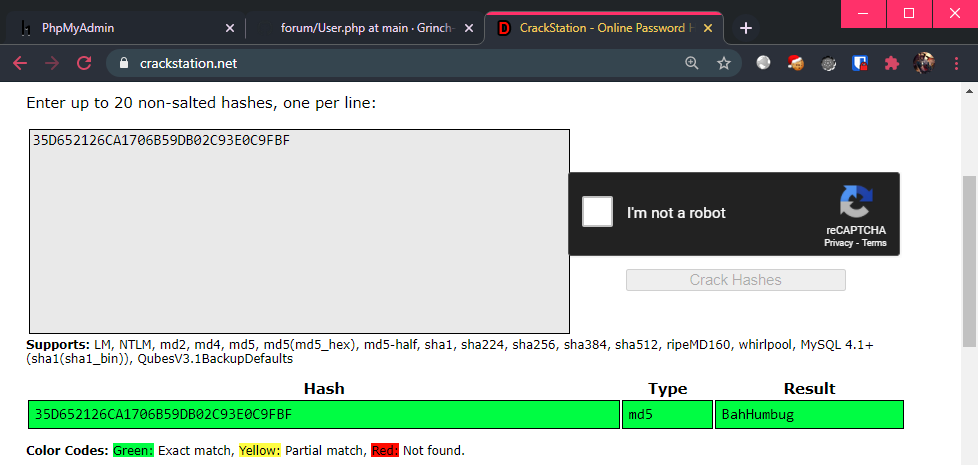
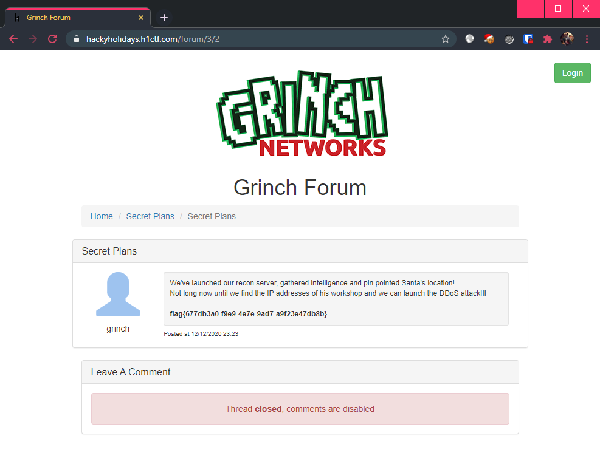

# Forum

**Challenge URL:** https://hackyholidays.h1ctf.com/forum

## Methodology

This landing page consisted of a simple bootstrap-styled "forum", as well as a login page.

<p align="center">
  
  
</p>

Once again, the login page does not appear to be vulnerable to SQL injection (when are we getting an SQLi challenge?).

I tried to poke around the application, fuzzing for any hidden pages using the PHP wordlist from [seclists](https://github.com/danielmiessler/SecLists/blob/master/Discovery/Web-Content/PHP.fuzz.txt). If a page does not exist, the server responds with a `404 Not Found`.

Using `ffuf`, the command looks like (filtering `404` response codes):
```bash
$ ffuf -w /usr/share/seclists/Discovery/Web-Content/PHP.fuzz.txt -u https://hackyholidays.h1ctf.com/forumFUZZ -t 100 -fc 404
```

Resulting in:
```bash
        /'___\  /'___\           /'___\       
       /\ \__/ /\ \__/  __  __  /\ \__/       
       \ \ ,__\\ \ ,__\/\ \/\ \ \ \ ,__\      
        \ \ \_/ \ \ \_/\ \ \_\ \ \ \ \_/      
         \ \_\   \ \_\  \ \____/  \ \_\       
          \/_/    \/_/   \/___/    \/_/       

       v1.1.0
________________________________________________

 :: Method           : GET
 :: URL              : https://hackyholidays.h1ctf.com/forumFUZZ
 :: Wordlist         : FUZZ: /usr/share/seclists/Discovery/Web-Content/PHP.fuzz.txt
 :: Follow redirects : false
 :: Calibration      : false
 :: Timeout          : 10
 :: Threads          : 100
 :: Matcher          : Response status: 200,204,301,302,307,401,403
 :: Filter           : Response status: 404
________________________________________________

/phpmyadmin             [Status: 200, Size: 8880, Words: 956, Lines: 79]
:: Progress: [104/104] :: Job [1/1] :: 104 req/sec :: Duration: [0:00:01] :: Errors: 0 ::
```

Which revealed that there is a `phpmyadmin` page! Visiting this shows yet another login page, which upon trying default credentials yielded no results. Once again, it was also not vulnerable to SQL injection.

<p align="center">
  
</p>

After poking around the application, I realized that I have reached a dead end, as there is absolutely nothing to go on. 😨

With nothing else to go on, maybe it's time for a little OSINT. Searching up the challenge creator, `Adam T. Langley`, we found his [Github profile](https://github.com/adamtlangley).

Scrolling down... Well well, what do we have here?

<p align="center">
  
</p>

After looking through the codebase, I had little doubt that this is the source code for this forum challenge. But, it appears that the code is quite secure, with no clear signs of authentication bypass.

Maybe I should take a look at the commit [history](https://github.com/Grinch-Networks/forum/commits/main)?

<p align="center">
  
</p>

Only the `small fix` commit was interesting, as there was a suspicious looking string that was removed in this commit:

<p align="center">
  
</p>

Could this be a password string? I decided to try out the credentials `forum:6HgeAZ0qC9T6CQIqJpD` at the `phpmyadmin` login page, which was successful!

<p align="center">
  
</p>

The user table contains 1 `admin` account, with the username `grinch` and the password `35D652126CA1706B59DB02C93E0C9FBF` which appears to be hashed.

Since we have access to the source code, we can easily find out what hash algorithm was used:

<p align="center">
  
</p>

It appears that `MD5` was used to hash the users' passwords. Time to crack it, firstly by checking if it was already cracked [online](https://crackstation.net/):

<p align="center">
  
</p>

Which is already the case! The credentials is thus `grinch:BahHumbug`. Time to finally login at the admin panel. Proceeding to the admin section, we see the flag handed to us:

<p align="center">
  
</p>

**Flag:** `flag{677db3a0-f9e9-4e7e-9ad7-a9f23e47db8b}`


## Thoughts 🔎
Personally, this was my least favourite challenge thus far simply due to the fact that there are no signs indicating that this is an OSINT challenge. Otherwise, once the repository is found, the path forward is straightforward.
