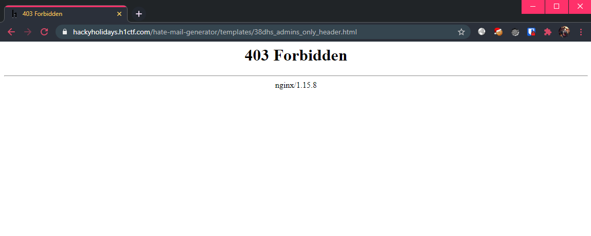

# Hate Mail Generator

**Challenge URL:** https://hackyholidays.h1ctf.com/hate-mail-generator

## Methodology

The landing page looks quite empty, with only 1 campaign `Guess What`. There was also an option to `Create New` post.

  

Checking the existing hate mail, I took a look at `Guess What`:

  

Previewing this post:

  

That syntax looks like a template engine is being used! 😮 I will definitely give it a test, since SSTI (Server Side Template Injection) may be a possibility.

Time to check out the `Create New` page:

  

The default "Markup" contains: `Hello {{name}} ....`. It does not allow us to `Create`, but we can still `Preview`:

  

Trying out a basic SSTI injection payload `{{7*7}}` only gave me errors:

  

Inspecting the request being sent revealed that the `name` key used in the markup is actually pre-defined on the client-side.

  

So the replacement actually uses client-side provided data in the parameter `preview_data`. If the key does not exist, then the error above will be shown. I could just substitute the value directly if I need to supply it, so what's the point! 🤔

I went back to the `Guess What` post and saw that the post uses `{{template:}}`, which seem to imply that template files are being fetched. Specifying a non-existent file (`abc.html`) gave a different error this time, **disclosing** the relative directory `/templates`:

  

Visiting /templates, see that a file called `38dhs_admins_only_header.html`. Trying to access says forbidden.

  
  

Well, it becomes clear now that we have to make use of this pseudo-templating engine, in order to **leverage on the server-side privileges** and include this protected file.

So, we have to change `{{name}}` to `{{template:38dhs_admins_only_header.html}}` right?

  

**Nope.**

Seems like the direct template replacement still happens on the client-side. Maybe we have to replace the value that is being sent in the `preview_data` parameter?

  

Which worked, giving us the flag!

  

Flag: `flag{5bee8cf2-acf2-4a08-a35f-b48d5e979fdd}`

## Thoughts 🐇
This challenge was a good one as the directions were pretty clear once the rabbit hole known as SSTI jumped across. I had a gut feeling that the SSTI was a rabbit hole since it was too good to be true, but I did some basic tests (following [hacktricks](https://book.hacktricks.xyz/pentesting-web/ssti-server-side-template-injection)) nonetheless. When none of them produced results, I stopped chasing that lead. Although, the final answer is actually pseudo-SSTI...
