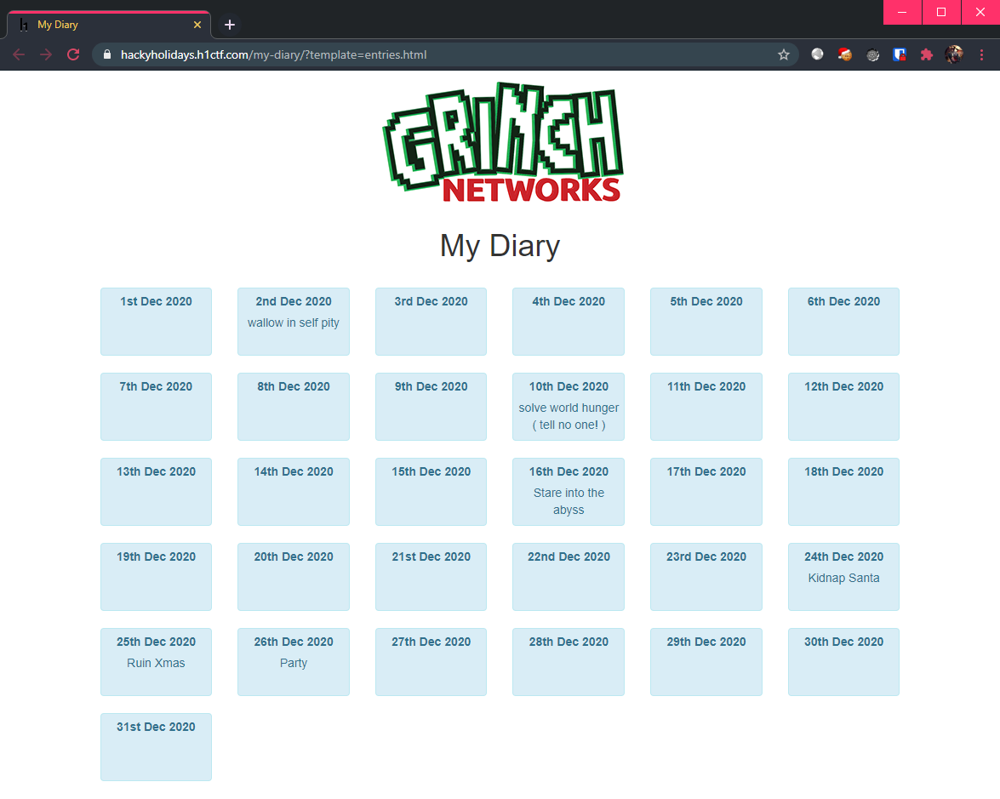
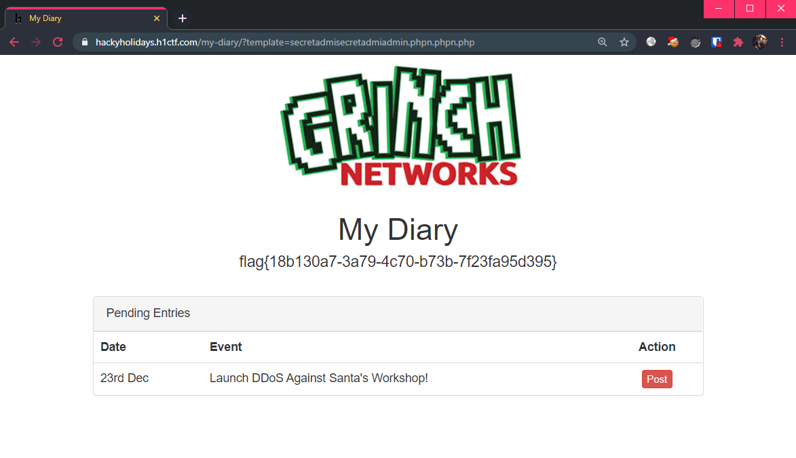

# My Diary

**Challenge URL:** https://hackyholidays.h1ctf.com/my-diary/?template=entries.html

## Methodology

Upon firing the challenge page up, I noticed that there is nothing much to go on in the landing page.

<p align="center">
  
</p>

I also saw that this page accepts a URL parameter `template` which is set to `entries.html` by default. Seems like the only way to proceed is to fuzz other possible pages. After testing a few manual pages, I realized that if the page specified in `template` is non-existent, the server will respond with a `302 Redirect` back to this landing page.

Time to use the trusty [seclists](https://github.com/danielmiessler/SecLists/blob/master/Discovery/Web-Content/common.txt) again! I have opted to use the `common.txt` wordlist in the `/Discovery/Web-Content` directory.

Using `ffuf`, the command looks like (filtering `302` response codes):
```bash
$ ffuf -w /usr/share/seclists/Discovery/Web-Content/common.txt -u https://hackyholidays.h1ctf.com/my-diary/?template=FUZZ -t 100 -fc 302
```

Resulting in:
```bash
        /'___\  /'___\           /'___\       
       /\ \__/ /\ \__/  __  __  /\ \__/       
       \ \ ,__\\ \ ,__\/\ \/\ \ \ \ ,__\      
        \ \ \_/ \ \ \_/\ \ \_\ \ \ \ \_/      
         \ \_\   \ \_\  \ \____/  \ \_\       
          \/_/    \/_/   \/___/    \/_/       

       v1.1.0
________________________________________________

 :: Method           : GET
 :: URL              : https://hackyholidays.h1ctf.com/my-diary/?template=FUZZ
 :: Wordlist         : FUZZ: /usr/share/seclists/Discovery/Web-Content/common.txt
 :: Follow redirects : false
 :: Calibration      : false
 :: Timeout          : 10
 :: Threads          : 100
 :: Matcher          : Response status: 200,204,301,302,307,401,403
 :: Filter           : Response status: 302
________________________________________________

index.php               [Status: 200, Size: 689, Words: 126, Lines: 22]
:: Progress: [4661/4661] :: Job [1/1] :: 388 req/sec :: Duration: [0:00:12] :: Errors: 0 ::
```

We obtained 1 result: `index.php` (maybe I should have tried this page manually 🤔). This [page](https://hackyholidays.h1ctf.com/my-diary/?template=index.php) does not have any visible output, so let's view the [source](view-source:https://hackyholidays.h1ctf.com/my-diary/?template=index.php):

```php
<?php
if( isset($_GET["template"])  ){
    $page = $_GET["template"];
    //remove non allowed characters
    $page = preg_replace('/([^a-zA-Z0-9.])/','',$page);
    //protect admin.php from being read
    $page = str_replace("admin.php","",$page);
    //I've changed the admin file to secretadmin.php for more security!
    $page = str_replace("secretadmin.php","",$page);
    //check file exists
    if( file_exists($page) ){
       echo file_get_contents($page);
    }else{
        //redirect to home
        header("Location: /my-diary/?template=entries.html");
        exit();
    }
}else{
    //redirect to home
    header("Location: /my-diary/?template=entries.html");
    exit();
}
```

Okay, seems like the goal is to reach the `/secretadmin.php` page. However, we see that there is some "defenses" going on, which does string replacement twice. First occurrence removes `admin.php`, and the second occurrence removes `secretadmin.php`. 

Notice a **flaw** with this "defense"?

By replacing the string directly, the remaining string chunks will be concatenated together. What happens if my input string is `secretadmiadmin.phpn.php`?

* secretadmi~~admin.php~~n.php **-->** `secretadmin.php`

Since we can subvert one replacement, we can subvert **both replacements** easily using the input string `secretadmisecretadmiadmin.phpn.phpn.php`:
1. secretadmisecretadmi~~admin.php~~n.phpn.php **-->** `secretadmisecretadmin.phpn.php`
2. secretadmi~~secretadmin.php~~n.php **-->** `secretadmin.php`

Meaning that the final URL should look like: https://hackyholidays.h1ctf.com/my-diary/?template=secretadmisecretadmiadmin.phpn.phpn.php, which gives us the flag!

<p align="center">
  
</p>

**Flag:** `flag{2e6f9bf8-fdbd-483b-8c18-bdf371b2b004}`


## Thoughts 👓
This challenge was slightly easier than expected, especially when the page to be fuzzed is not that secretive. In fact, I am sure there are many others that have guessed the `index.php` page right away. Once finding this page, the source is given so it is trivial to subvert the logic.
