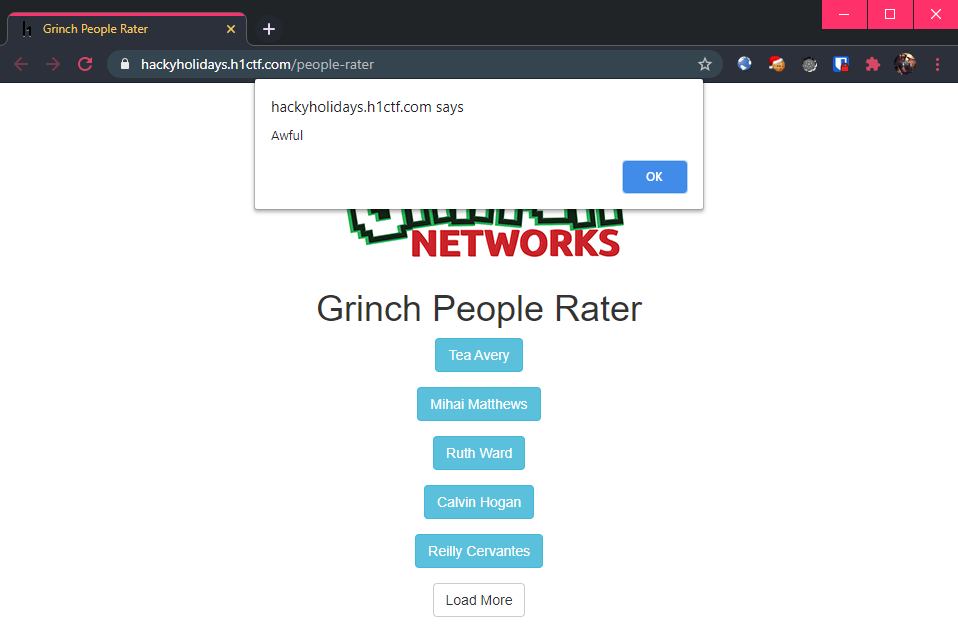
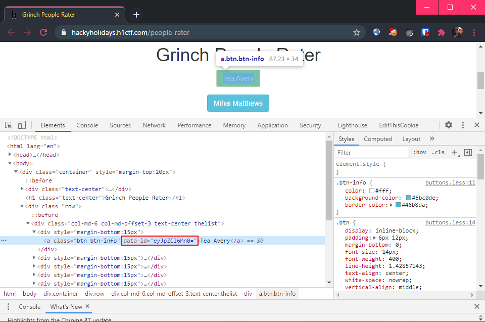
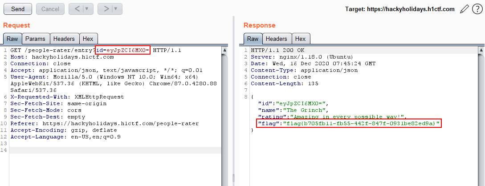

# People Rater

**Challenge URL:** https://hackyholidays.h1ctf.com/people-rater

## Methodology
This was a plain looking page that had buttons which upon clicking, pops an alert box containing Grinch's ratings of people. 😮

<p align="center">
  
</p>

> Tea Avery is "Awful". I wonder why...

Well, sitting around clicking random bootstrap buttons is not my style, so let's dive into the *page source*! The following JavaScript was found on this page:
```js
$('.thelist').on("click", "a", function(){
    $.getJSON('/people-rater/entry?id=' + $(this).attr('data-id'), function(resp){
        alert( resp.rating );
    }).fail(function(){
        alert('Request failed');
    });
});
```

This is a [jQuery](https://api.jquery.com/on/) event handler that sends a JSON-formatted `GET` request to `/people-rater/entry?id=<DATA-ID>` where `<DATA-ID>` is an attribute from the button that was clicked.

Inspecting the buttons using my Chrome browser's [developer tools](https://developers.google.com/web/tools/chrome-devtools), I see that the `Tea Avery` button has an attribute `data-id=eyJpZCI6Mn0=`.

<p align="center">
  
</p>

This `data-id` looks to be encoded in base-64 format, so I went ahead and decode it:

```bash
$ echo "eyJpZCI6Mn0=" | base64 -d; echo

{"id":2}
```

Seems like the first button - `Tea Avery`, has an `id` of `2`. Who is `1` then? Only one way to find out:

```bash
$ echo '{"id":1}' | base64

eyJpZCI6MX0K
```

To find out who is *numero uno*, I sent a `GET` request to `/people-rater/entry?id=eyJpZCI6MX0K`:

<p align="center">
  
</p>

**Flag:** `flag{b705fb11-fb55-442f-847f-0931be82ed9a}`


## Thoughts 🥇
This was pretty straightforward as long as one can read simple JavaScript and understand what the buttons' event handler was doing. Also, being able to recognize the base-64 encoded `data-id` attribute would be key in solving this challenge.
