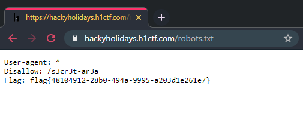

# Robots

**(Hidden) Challenge URL:** https://hackyholidays.h1ctf.com/robots.txt

## Methodology
One of the most common practices when testing a web application is to examine its [robots.txt](https://developers.google.com/search/docs/advanced/robots/intro) file to see if it contains any sensitive directories.

This is because website developers do not want search engines to publicly index these "private" directories onto their search engine results. However, they forgot that *humans* can simply look at the file. 😅

> 🙋‍♂🙋‍♀️ != 🤖

  

**Flag:** `flag{48104912-28b0-494a-9995-a203d1e261e7}`

## Thoughts 🤖
This was the most trivial flag which I believe anyone (even slightly) familiar with testing web applications would immediately find!

I also noticed that in the robots file, there is a URL at `/s3cr3t-ar3a`. Is it time for the [next flag](s3cr3t-ar3a.md)?
