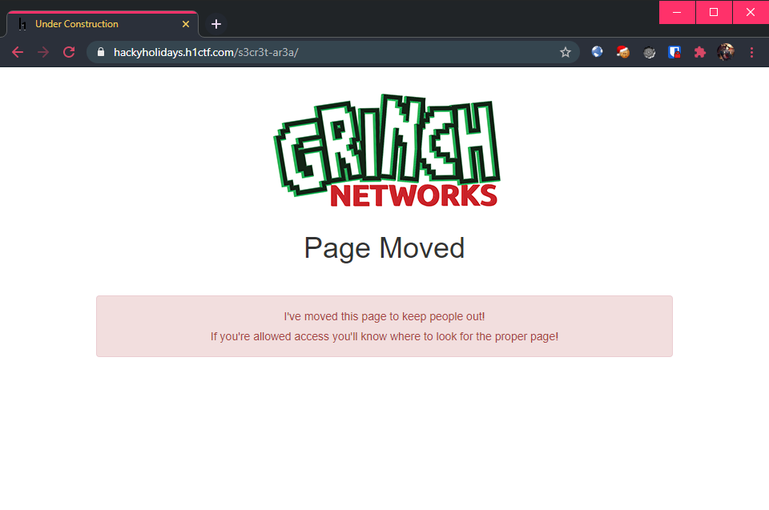
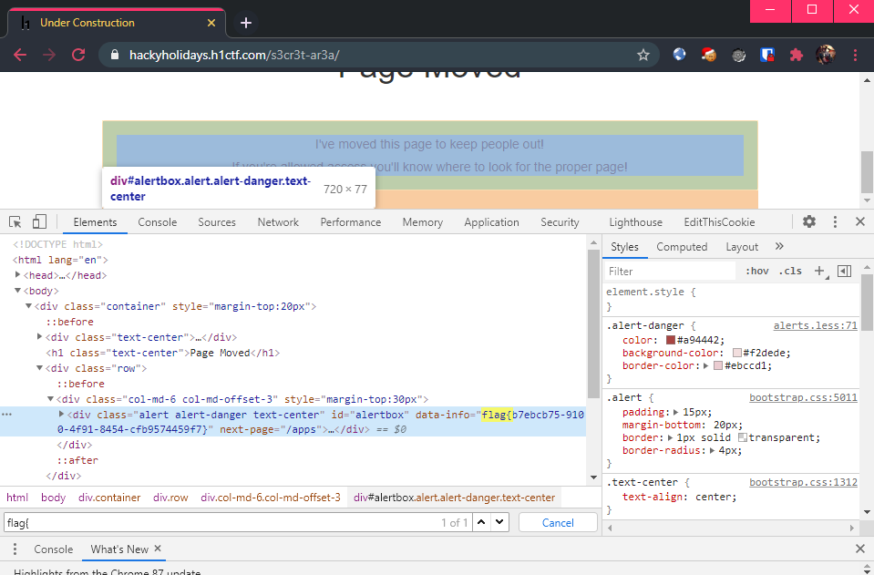

# s3cr3t-ar3a

**(Hidden) Challenge URL:** https://hackyholidays.h1ctf.com/s3cr3t-ar3a/

## Methodology

After discovering this URL from the robots.txt file which contained the [robots flag](robots.md), this was what I found:

  

Nothing much to go on, so I opened my Chrome browser's [developer tools](https://developers.google.com/web/tools/chrome-devtools) to see if there are anything interesting that is not visible. Since I know that the flag format is `flag{...}`, I did a search for `flag{` among the page elements. True enough, the flag is found to be hidden as an `data-info` attribute of the red-colored element.

  

**Flag:** `flag{b7ebcb75-9100-4f91-8454-cfb9574459f7}`

## Thoughts 🆓
There is a "trap" where if you viewed the entire source of the page (`CTRL + U` for Chrome), the `data-info` will not be shown. This is because the flag is inserted into the page dynamically by JavaScript.

Otherwise, this flag is a freebie once you have found the robots flag.
