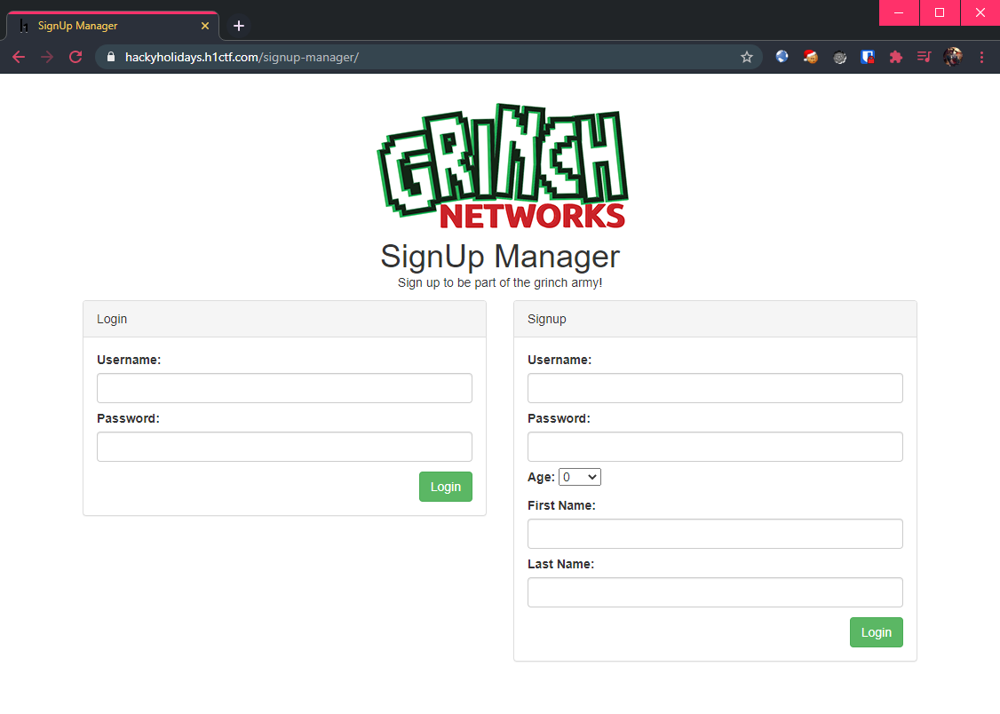
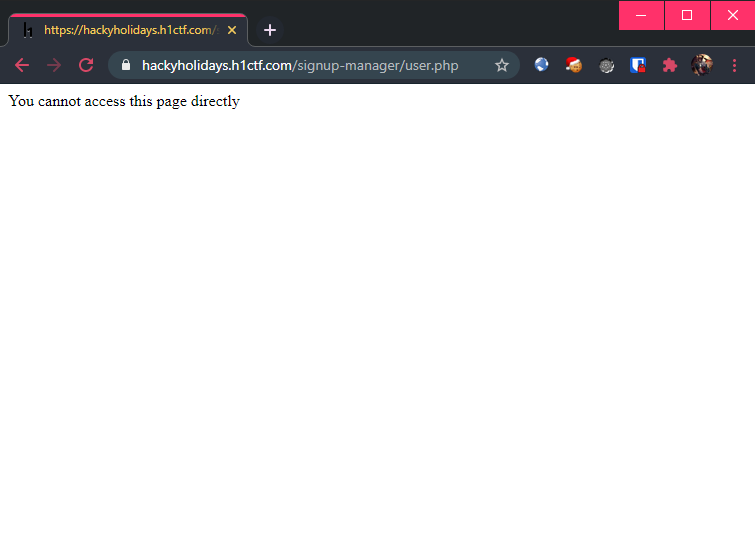
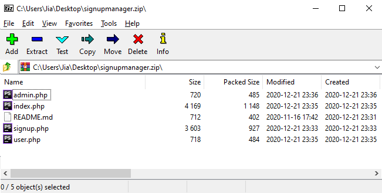
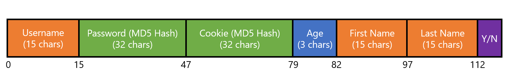
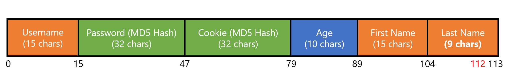
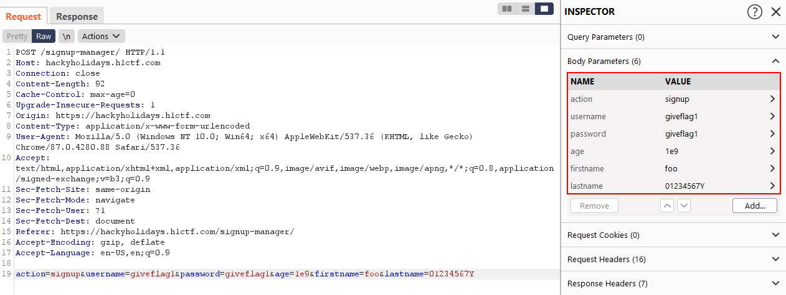
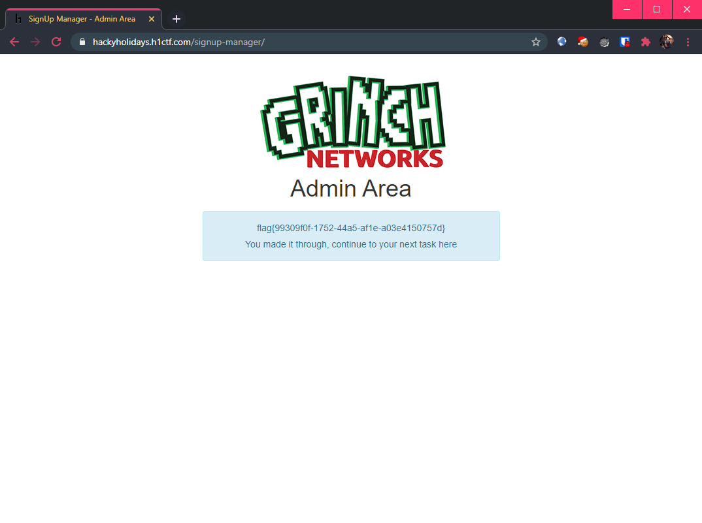

# Signup Manager

**Challenge URL:** https://hackyholidays.h1ctf.com/signup-manager

## Methodology

Opening the application page reveals a simple page with signup/login forms.

<p align="center">
  
</p>

Upon registration (or logging in), a session is created and the page now shows:

<p align="center">
  
</p>

> Login and signup forms does not appear to be vulnerable to SQL injection.

With no other pages to poke around, this CTF has taught us that it is time to fuzz. This time round, I tried a different tool: [dirsearch](https://github.com/maurosoria/dirsearch).

Usage was simple as it has its built-in wordlist as well:
```
$ python3 dirsearch.py -u https://hackyholidays.h1ctf.com/signup-manager -t 100

...
[23:29:23] Starting: 
[23:29:34] 200 -  712B  - /signup-manager/README.md
[23:29:37] 200 -   36B  - /signup-manager/admin.php
[23:29:50] 200 -   15KB - /signup-manager/index.php
[23:29:58] 200 -   36B  - /signup-manager/signup.php
[23:30:00] 200 -   36B  - /signup-manager/user.php

Task Completed
```

Visiting all 4 of the `PHP` pages returned the same response:

<p align="center">
  
</p>

However, `README.md` contained promising information:

```md
# SignUp Manager

SignUp manager is a simple and easy to use script which allows new users to signup and login to a private page. All users are stored in a file so need for a complicated database setup.

### How to Install

1) Create a directory that you wish SignUp Manager to be installed into

2) Move signupmanager.zip into the new directory and unzip it.

3) For security move users.txt into a directory that cannot be read from website visitors

4) Update index.php with the location of your users.txt file

5) Edit the user and admin php files to display your hidden content

6) You can make anyone an admin by changing the last character in the users.txt file to a Y

7) Default login is admin / password
```

> We will keep `6)` in mind, while `7)` is fake news. 🚔

Seems like there is a source code zip file that we can try to obtain: `signupmanager.zip`. Downloading it and inspecting it reveals what appears to be the codebase for this application:

<p align="center">
  
</p>

Among the source codes, only `index.php` looks the most promising. The remaining pages does not give us additional information to go on.

### Authentication Bypass

After analysing the `index.php` file, it appears to do some kind of pseudo-"(de)serialization" where the information for each user is stored as a single line in a text file (`user.txt`).

This is the function used to "serialize" new users into the `user.txt` file:
```php
function addUser($username,$password,$age,$firstname,$lastname){
  $random_hash = md5( print_r($_SERVER,true).print_r($_POST,true).date("U").microtime().rand() );
  $line = '';
  $line .= str_pad( $username,15,"#");
  $line .= $password;
  $line .= $random_hash;
  $line .= str_pad( $age,3,"#");
  $line .= str_pad( $firstname,15,"#");
  $line .= str_pad( $lastname,15,"#");
  $line .= 'N';
  $line = substr($line,0,113);
  file_put_contents('users.txt',$line.PHP_EOL, FILE_APPEND);
  return $random_hash;
}
```

This is the function used to "deserialize" existing users from the `user.txt` file:
```php
function buildUsers(){
  $users = array();
  $users_txt = file_get_contents('users.txt');
  foreach( explode(PHP_EOL,$users_txt) as $user_str ){
    if( strlen($user_str) == 113 ) {
      $username = str_replace('#', '', substr($user_str, 0, 15));
      $users[$username] = array(
          'username' => $username,
          'password' => str_replace('#', '', substr($user_str, 15, 32)),
          'cookie' => str_replace('#', '', substr($user_str, 47, 32)),
          'age' => intval(str_replace('#', '', substr($user_str, 79, 3))),
          'firstname' => str_replace('#', '', substr($user_str, 82, 15)),
          'lastname' => str_replace('#', '', substr($user_str, 97, 15)),
          'admin' => ((substr($user_str, 112, 1) === 'Y') ? true : false)
      );
    }
  }
  return $users;
}
```

The structure below illustrates how users are being stored (insufficient characters are padded with `#`):

<p align="center">
  
</p>

> The 113<sup>rd</sup> character determines if this user is an admin (by specifying `Y` or `N`). 

And the relevant `PHP` code that deals with `signup` requests:
```php
if ($_POST["action"] == 'signup' && isset($_POST["username"], $_POST["password"], $_POST["age"], $_POST["firstname"], $_POST["lastname"])) {
  $username = substr(preg_replace('/([^a-zA-Z0-9])/', '', $_POST["username"]), 0, 15);
  if (strlen($username) < 3) {
      $errors[] = 'Username must by at least 3 characters';
  } else {
      if (isset($all_users[$username])) {
          $errors[] = 'Username already exists';
      }
  }
  $password = md5($_POST["password"]);
  $firstname = substr(preg_replace('/([^a-zA-Z0-9])/', '', $_POST["firstname"]), 0, 15);
  if (strlen($firstname) < 3) {
      $errors[] = 'First name must by at least 3 characters';
  }
  $lastname = substr(preg_replace('/([^a-zA-Z0-9])/', '', $_POST["lastname"]), 0, 15);
  if (strlen($lastname) < 3) {
      $errors[] = 'Last name must by at least 3 characters';
  }
  if (!is_numeric($_POST["age"])) {
      $errors[] = 'Age entered is invalid';
  }
  if (strlen($_POST["age"]) > 3) {
      $errors[] = 'Age entered is too long';
  }
  $age = intval($_POST["age"]);
  if (count($errors) === 0) {
      $cookie = addUser($username, $password, $age, $firstname, $lastname);
      setcookie('token', $cookie, time() + 3600);
      header("Location: " . explode("?", $_SERVER["REQUEST_URI"])[0]);
      exit();
  }
}
```

We see that the parameters `username`, `firstname` and `lastname` are restricted to at most 15 alphanumeric characters only, while the `password` field is hashed using `MD5`. This leaves us with just the `age` parameter to tamper with.

#### Aren't You Forgetting Som(e)thing?
Observe that `age` is first checked using the `is_numeric()` PHP [function](https://www.php.net/manual/en/function.is-numeric.php). Looking at the documentation, it appears that this function parses the [Euler number](https://en.wikipedia.org/wiki/E_(mathematical_constant)) as well:

```php
$element = 1e9;

if (is_numeric($element)) {
  echo var_export($element, true) . " is numeric", PHP_EOL;
} else {
  echo var_export($element, true) . " is NOT numeric", PHP_EOL;
}


Output > '1e9' is numeric
```

Furthermore, the `$age` variable stores the **converted** value after calling the `intval()` [function](https://www.php.net/manual/en/function.intval.php) with the supplied value:

```php
$element = intval('1e9');
echo var_export($element, true);


Output > '1000000000'
```

However, we are limited to just 3 characters in the `age` parameter since there is a `strlen()` check as well. But, this is just nice since we are able to supply a value containing the Euler number, which will effectively **break the assumption** that `age` is at most 3 characters long. Let us see if we can now create an admin user by setting the 113<sup>rd</sup> character to `Y`.

#### Time to Start Counting! 
Using the value `1e9` for the `age` parameter gives a resultant length of **10 characters** (`1000000000`)! Referencing the diagram of the "user" structure, as well as how new users are "serialized" into the text file above, we should be able to control the 113<sup>rd</sup> character.

Thus, the structure now looks like:

<p align="center">
  
</p>

Now, it is time to put the findings together. I sent a signup request while adhering to the constraints:
```
username: <any>
password: <any>
age: 1e9
firstname: <any>
lastname: 01234567Y
```

<p align="center">
  
</p>

After logging in with this newly created user, the flag was shown:
<p align="center">
  
</p>

We are also shown the challenge [page](https://hackyholidays.h1ctf.com/r3c0n_server_4fdk59) for the [next challenge](r3c0n-server.md).

**Flag:** `flag{99309f0f-1752-44a5-af1e-a03e4150757d}`


## Thoughts 🔢
This was an interesting challenge which tested the ability to sieve out the not so well-known quirks of PHP functions. There is just a small rabbit hole of finding the `user.txt`, but we all know that when the source is given, we should take a *close* look at it. Don't be lazy and assume how certain functions work, RTFM saves lives (and time).

Also, another reason why storing credentials in a hacky fashion is not a good idea at all:

> All users are stored in a file so need for a complicated database setup.

Famous last words indeed. 😅

In other news... I completely did not see notice that the first line in the HTML source of the landing page wrote `<!-- See README.md for assistance -->`. 🤦‍♂️ Also, the initial available zip file was incomplete, as there was only 1 `admin.php` inside (which was of no use). Thankfully, the `dirsearch` tool managed to find all the relevant files anyway!
