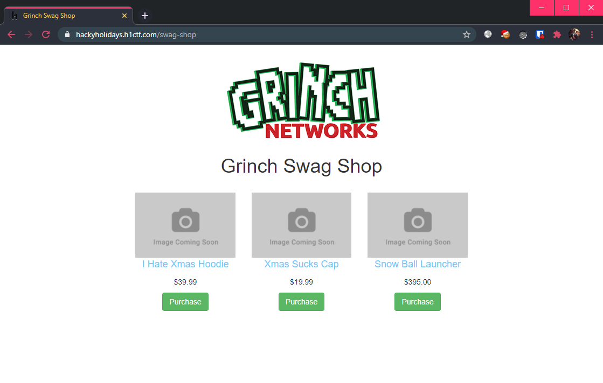
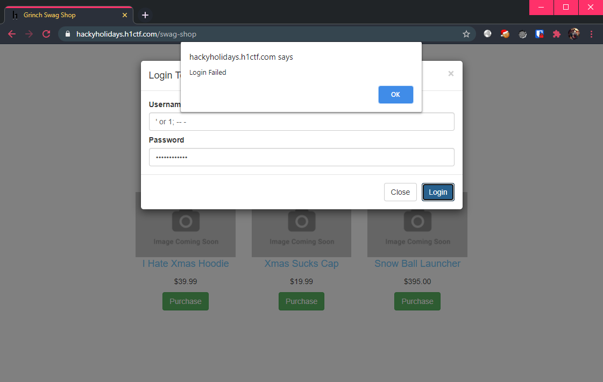
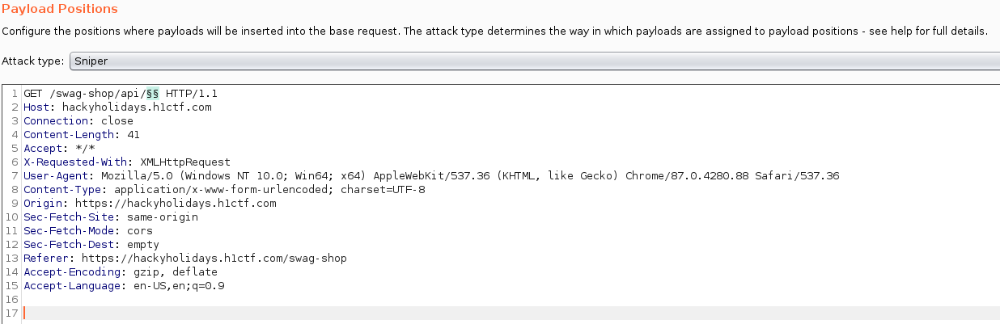
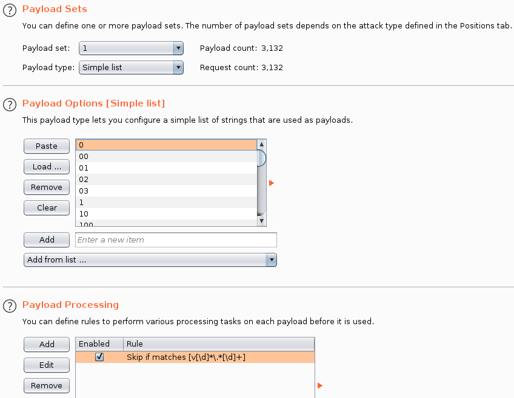
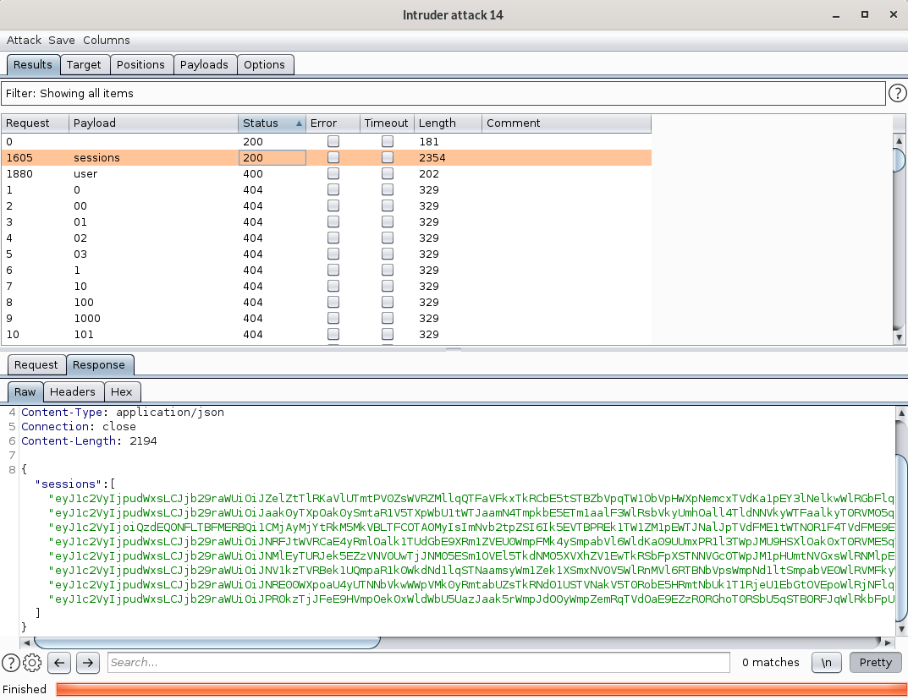
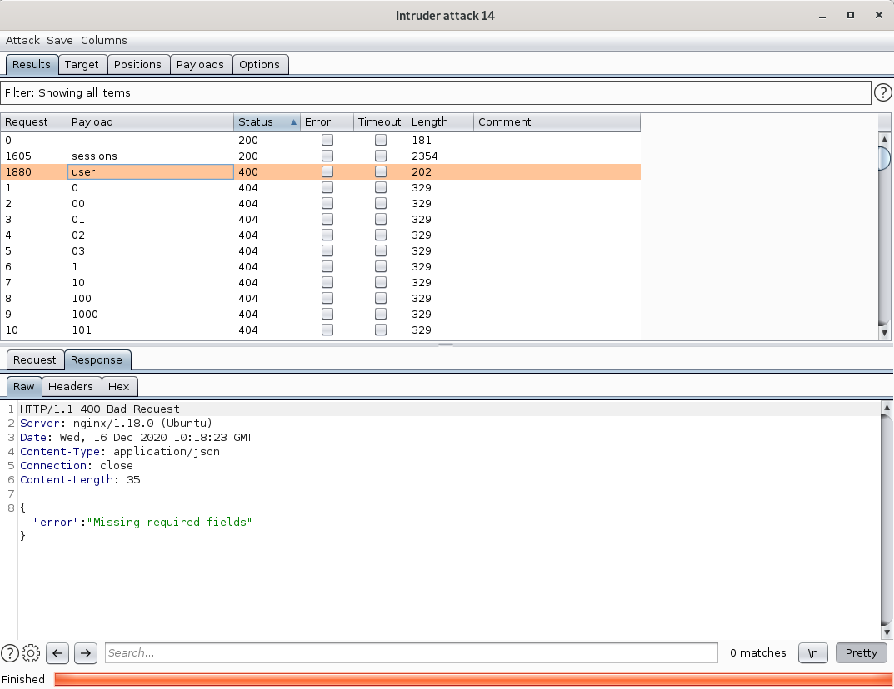
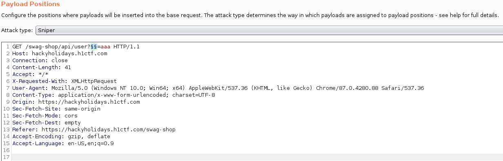
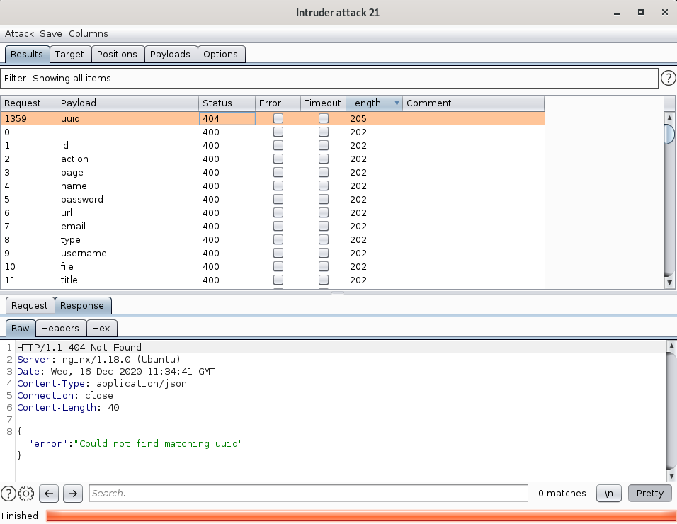
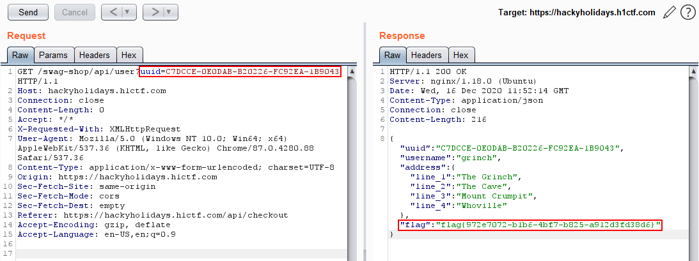

# Swag Shop

**Challenge URL:** https://hackyholidays.h1ctf.com/swag-shop

## Methodology
This is Grinch's swag shop, time to see what's on sale!

<p align="center">
  
</p>

Clicking on "Purchase" of any of these items brings up a login modal. Unfortunately, an attempt of SQL injection (`or 1; -- -`) did not allow us to bypass the authentication.

<p align="center">
  
</p>

Looking at the requests being sent from my previous actions, I observed that there were 2 `POST` requests made:
* `/api/purchase`
* `/api/login`

Both requests were responded with a `401 Unauthorized` response code.

With nowhere else to go, it was time to fuzz the API end-points of this swaggity-swag shop.

### Fuzzing API End-points

I did not wish for things to head this direction, but seems like there are no other options. 😩

My choice of tool was Burp Intruder and I used the `objects.txt` wordlist from Daniel Miessler's seclists [here](https://github.com/danielmiessler/SecLists/blob/master/Discovery/Web-Content/api/objects.txt). Then, setting up Intruder to fuzz the end-points at `/api/<FUZZ>`:

<p align="center">
  
</p>

Since the wordlist contained (what I think are) irrelevant entries like version strings, I made sure to ignore them in my Intruder settings, using the regex `/v[\d]*\.*[\d]+/`:

<p align="center">
  
</p>

And going for a short ☕ break while waiting for the attack to run...

When I returned, I was greeted with 2 valid end-points (no `404` response):

* `/api/sessions`
<p align="center">
  
</p>

* `/api/user`
<p align="center">
  
</p>

I examined the `sessions` end-point first, noticing that there are 8 sets of base-64 encoded strings, so I went to decode them:

```bash
$ echo "eyJ1c2VyIjoiQzdEQ0NFLTBFMERBQi1CMjAyMjYtRkM5MkVBLTFCOTA0MyIsImNvb2tpZSI6Ik5EVTBPREk1TW1ZM1pEWTJNalJpTVdFME1tWTNOR1F4TVdFME9ETXhNemcyTUdFMVlXUmhNVGMwWWpoa1lXRTNNelUxTWpaak5EZzVNRFEyWTJKaFlqWTNZVEZoWTJRM1lqQm1ZVGs0TjJRNVpXUTVNV1E1T1dGa05XRTJNakl5Wm1aak16WmpNRFEzT0RrNVptSTRaalpqT1dVME9HSmhNakl3Tm1Wa01UWT0ifQ==" | base64 -d; echo

{"user":"C7DCCE-0E0DAB-B20226-FC92EA-1B9043","cookie":"NDU0ODI5MmY3ZDY2MjRiMWE0MmY3NGQxMWE0ODMxMzg2MGE1YWRhMTc0YjhkYWE3MzU1MjZjNDg5MDQ2Y2JhYjY3YTFhY2Q3YjBmYTk4N2Q5ZWQ5MWQ5OWFkNWE2MjIyZmZjMzZjMDQ3ODk5ZmI4ZjZjOWU0OGJhMjIwNmVkMTY="}
```

 After decoding, I realized that **all but 1** of them had the `user` parameter set to `null`. So, it is possible that only this session string is valid.

Next, I examined the `user` end-point, which had a `400` response code from the server, stating that there are missing parameters. Well, since I had to fuzz to find these end-points, maybe the parameter had to be fuzzed as well? 🤔

Setting up my Burp Intruder yet again, this time using `burp-parameter-names.txt` wordlist from the same seclists repository [here](https://github.com/danielmiessler/SecLists/blob/master/Discovery/Web-Content/burp-parameter-names.txt). I was going to fuzz `/api/user?<FUZZ>=aaa` (random string used as value):

<p align="center">
  
</p>

... Maybe a 🍕 break this time? 😋

After the fuzz has completed, I found that `uuid` is the mystery parameter that I need for this `user` end-point!

<p align="center">
  
</p>

Since the server response mentioned about matching `uuid`, remember where we obtained a `uuid`-looking string? That's right, at the `sessions` end-point!

> `"user":"C7DCCE-0E0DAB-B20226-FC92EA-1B9043"`

Time to utilize the decoded string:

<p align="center">
  
</p>

Which gave me the flag at last!

**Flag:** `flag{972e7072-b1b6-4bf7-b825-a912d3fd38d6}`


## Thoughts
This challenge was unexpectedly tricky, probably because I did not expect there to be fuzzing challenges (server load and all, with such a large participation too). However, once the mental barrier has been cleared, I just had to find a nice wordlist. Luckily, seclists can always be depended on. 😎

There were rabbit holes that I fell into, such as trying to use the decoded session `cookie` key to gain authentication at previously known end-points. Being too fixated on gaining authentication was most likely a common pitfall for most of us, especially when the client-side JavaScript code looked so *sus*.
